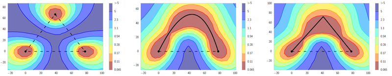

<html lang="ja">
    <head>
        <meta charset="utf-8" />
    </head>
    <body>
<h1>
Seminal Papers
</h1>
<h2>なにものか？</h2>

DNN 関連の研究で源流になるような論文を集めようと思う。 
※「seminal」は「影響力のある」「種をまくような」という意味で、 
　後続の研究に大きな影響を与えた論文を指します。(by Copilot) 
 
・現象を初めて発見した, 初めて報告した。 
・現象に命名して統一的に研究できるようにした 
　など

源流が判れば, 引用論文を辿って, その後の進展を調べることができる。 
アルファベット順

<h3>● 3D  Gaussian Splatting (3DGS)</h3>
→ NVS: Novel View Synthesis

<h3>● Acquiescence Bias (黙認バイアス)</h3>

『Acquiescence Bias in Large Language Models』(2025) 
　(大規模言語モデルにおける黙認バイアス) 
　論文は<a href="https://arxiv.org/abs/2509.08480">こちら</a> 
 
　「天気は良いですか、悪いですか？」という質問は、「天気は良いですか？」という質問とは異なる回答を導き出す可能性がある。この現象は「黙認バイアス」と呼ばれ、十分に文書化されており、数十年にわたって研究されてきた。
(アンケート回答者が、自分の本心とは関係なく、ある発言に同意する傾向がある場合、同意バイアスまたは「イエス」バイアスとも呼ばれる黙認バイアスを示すと言われている)。異なるモデル、タスク、言語（英語、ドイツ語、ポーランド語）におけるLLMの黙認バイアスの存在を調査した。結果は、人間とは対照的に、LLMは同意か不同意かに関わらず、「いいえ」と答える傾向を示すことを示唆している。

<h3>● Active learning (能動学習)</h3>
能動学習問題とは、学習者が自身の訓練データに影響を与えたり選択したりする能力、あるいはその必要性を持つ問題。 
『Active Learning with Statistical Models』(1994)で提唱された。 
 

『Active learning of inverse models with intrinsically motivated goal exploration in robots』(2013) 
　(ロボットにおける内発的動機付けに基づく目標探索による逆モデルの能動学習) 
　論文は<a href="https://arxiv.org/abs/1301.4862">こちら</a> 
 
　高次元ロボティクススキルのレパートリーを学習する上での、能力進捗度に基づく目標選択の効率性を導入・実証した。

<h3>●Adversarial Vulnerabilities (敵対的脆弱性)</h3>

『Intriguing properties of neural networks』(2013) 
　(ニューラルネットワークの興味深い特性) 
　論文は<a href="https://arxiv.org/abs/1312.6199">こちら</a> 
 
　ニューラルネットワークにおける敵対的脆弱性を初めて発見したもの。

『Explaining and Harnessing Adversarial Examples』(2014) 
　(敵対的サンプルの解明と活用) 
　論文は<a href="https://arxiv.org/abs/1412.6572">こちら</a>, 要約は<a href="https://www.alphaxiv.org/ja/overview/1412.6572v3">こちら</a> 
 
パンダ画像に少しノイズを加えるとテナガザルと誤認識する、という例の論文。
最先端のモデルが知覚できない摂動によって体系的に騙されることを実証することで、安全性に重要なアプリケーションに展開されているAIシステムにおける重大な脆弱性を浮き彫りにした。

『Extracting training data from large language models』(2020) 
　(大規模言語モデルからの学習データ抽出) 
　論文は<a href="https://arxiv.org/abs/2012.07805">こちら</a>, 要約は<a href="https://www.alphaxiv.org/ja/overview/2012.07805v2">こちら</a> 
 
この画期的な研究は、大規模言語モデルからの学習データ抽出における具体的なリスクを実証し、プライバシーの脆弱性に対する重要な証拠を提供
した。

『The secret sharer: Evaluating and testing unintended memorization in neural networks』(2018) 
　(秘密の共有者：ニューラルネットワークにおける意図せざる記憶の評価と検証) 
　論文は<a href="https://arxiv.org/abs/1802.08232">こちら</a>, 要約は<a href="https://www.alphaxiv.org/ja/overview/1802.08232v3">こちら</a> 
 
　「カナリア」挿入を用いてニューラルネットワークから学習データを抽出する概念を確立。

『Membership inference attacks against machine learning models』(2016) 
　(機械学習モデルに対するメンバーシップ推論攻撃) 
　論文は<a href="https://arxiv.org/abs/1610.05820">こちら</a>, 要約は<a href="https://www.alphaxiv.org/ja/overview/1610.05820v2">こちら</a> 
 
攻撃者が特定の例が訓練セットに含まれていたかどうかを判断する、密接に関連した問題であるメンバーシップ推論攻撃に関する基礎的な研究

<h3>● AI Alignment (AIアライメント), RLHF, DPO</h3>
・人間の意図する目的や嗜好、倫理原則に合致させること 
　<a href="https://intelligence.org/files/CFAI.pdf">Creating Friendly AI 1.0 (2001)</a>で概念が提唱され 
　<a href="https://intelligence.org/files/obsolete/TechnicalAgenda%5Bold%5D.pdf">Aligning Superintelligence with Human Interests:A Technical Research Agenda (2014)</a>でAI Alignment という用語が提唱された。 
・RLHF: Reinforment Learning from Human Feedback 
・DPO: Direct Preference Optimization 
 

『Direct preference optimization: Your language model is secretly a reward model』(2023) 
　(ダイレクト選好最適化：あなたの言語モデルは密かに報酬モデルである) 
　論文は<a href="https://arxiv.org/abs/2305.18290">こちら</a>, 要約は<a href="https://www.alphaxiv.org/ja/overview/2305.18290v3">こちら</a> 
 
　人間からのフィードバックによる強化学習（RLHF:Reinforcement Learning from Human Feedback）の複雑さを回避し、大規模言語モデルを人間の好みに合わせてファインチューニングする手法を導入してい

『Training language models to follow instructions with human feedback』(2022) 
　(人間からのフィードバックによる指示追従言語モデルの訓練) 
　論文は<a href="https://arxiv.org/abs/2203.02155">こちら</a>, 要約は<a href="https://www.alphaxiv.org/ja/overview/2203.02155v1">こちら</a> 　
 
多段階の人間からのフィードバックによる強化学習（RLHF）パイプラインを確立した

『A general language assistant as a laboratory for alignment』(2021) 
　(アライメントの実験室としての一般言語アシスタント) 
　論文は<a href="https://arxiv.org/abs/2112.00861">こちら</a> 
 
　有用性、正直さ、無害さに焦点を当てたアライメント評価のフレームワーク

<h3>● AI-image detectors</h3>

『CNN-generated images are surprisingly easy to spot... for now』(2019) 
　(CNN生成画像は驚くほど見破りやすい…今のところは) 
　論文は<a href="https://openaccess.thecvf.com/content_CVPR_2020/papers/Wang_CNN-Generated_Images_Are_Surprisingly_Easy_to_Spot..._for_Now_CVPR_2020_paper.pdf">こちら</a> 
 
　AI画像検出器における汎化問題を初めて浮き彫りにした基礎的な論文    

<h3>● Attention Sinks</h3>

　『Efficient streaming language models with attention sinks』(2023) 
　論文は<a href="https://arxiv.org/abs/2309.17453">こちら</a>, 要約は<a href="https://www.alphaxiv.org/ja/overview/2309.17453v4">こちら</a> 
 
　「アテンションシンク」現象を初めて特定し、命名した基礎的な論文    

『Massive activations in large language models』(2024) 
　(大規模言語モデルにおける大規模な活性化) 
　論文は<a href="https://arxiv.org/abs/2402.17762">こちら</a>,要約は<a href="https://www.alphaxiv.org/ja/overview/2402.17762v2">こちら</a> 
 
言語モデルにおける「大規模な活性化 (massive activations)」が「アテンションシンク (attention sinks)」を引き起こすという並行現象を特定しており、トランスフォーマーにおける高ノルムトークンの問題に対し、より広範な文脈を提供する

『Vision Transformers Don't Need Trained Registers』(2025) 
　(ビジョン・トランスフォーマーに学習済みレジスタは不要) 
　論文は<a href="">こちら</a>, 要約は<a href="https://www.alphaxiv.org/ja/overview/2506.08010v4">こちら</a> 
 

Vision Transformer (ViT) のMLPブロック内の特定の「レジスタニューロン」が、高ノルムトークンの因果的な発生源であることを特定した。未学習のトークンを付加し、これらの高ノルム活性をリダイレクトする訓練不要の手法「テスト時レジスタ」を導入した。これにより、よりクリーンなアテンションマップ、密な視覚タスクと物体発見における性能向上、そしてVision-Languageモデルにおける解釈可能性の向上がもたらされた。 
 
言語モデルにおける同様の現象（「アテンションシンク」）と関連しており、このような計算パターンがモダリティを超えたトランスフォーマーアーキテクチャにとって基本的なものである可能性を示唆している。

<h3>● Baldwin effect (ボールドウィン効果)</h3>
学習能力が高くなる方向に選択が進むことを示唆したもの。 
 

『A new factor in evolution』(1896) 
　(進化における新しい要素) 
　論文は<a href="https://www.journals.uchicago.edu/doi/pdf/10.1086/276408">こちら</a> 
 
　ボールドウィン効果を紹介するもの。 
　学習した行動が、生物の行動獲得能力を高める遺伝的特性に対する選択圧を生み出すことによって、進化の過程に影響を与える可能性があると提唱している。

『How learning can guide evolution』(1987) 
　(学習が進化を導く方法) 
　論文は<a href="https://pages.ucsd.edu/~rbelew/courses/cogs184_w10/readings/HintonNowlan97.pdf">こちら</a> 
 
　獲得形質は遺伝しないという仮定は、生物が生涯を通じて学習する適応が進化の過程を導くことができないと解釈されることが多い。この推論は誤りである（2）。学習は進化が作用する探索空間の形状を変化させ、それによって共適応した対立遺伝子の集合に向かう良好な進化経路を提供する。我々は、この効果により、表現型によって獲得された形質が遺伝子型に伝達されないにもかかわらず、学習生物は学習していない生物よりもはるかに速く進化できることを実証する。

『Encoding innate ability through a genomic bottleneck』(2024) 
　(ゲノムボトルネックを介した生来の能力のエンコード) 
　論文は<a href="https://www.biorxiv.org/content/biorxiv/early/2022/05/26/2021.03.16.435261.full.pdf">こちら</a> 
 
動物は、ゲノムにコード化された神経回路から生じる広範な生得的な行動能力を持って生まれます。しかし、ゲノムの情報容量は、任意の脳回路の接続性を指定するために必要な量よりも桁違いに小さいため、回路形成をコード化する規則は、世代から世代へと受け継がれる際に「ゲノムボトルネック」を通過しなければならないことを示しています。 
本稿では、人工ニューラルネットワークの文脈における生得的な行動能力の問題を、重み行列の非可逆圧縮の観点から定式化します。その結果、いくつかの標準的なネットワークアーキテクチャは数桁圧縮可能であり、事前学習の性能は完全に学習されたネットワークに近づく可能性があることが分かりました。 
興味深いことに、複雑なテスト問題では、単純なテスト問題とは異なり、ゲノムボトルネックアルゴリズムは回路の本質的な特徴も捉え、新しいタスクやデータセットへの転移学習を強化します。

『Evolution imposes an inductive bias that alters and accelerates learning dynamics』(2025) 
　(進化は学習力学を変化させ、加速させる帰納的バイアスを課す) 
　論文は<a href="https://arxiv.org/abs/2505.10651">こちら</a>, 要約は<a href="https://www.alphaxiv.org/ja/overview/2505.10651v1">こちら</a> 
 
　進化的最適化とオンライン学習を分離する新しいアルゴリズムを通じて、進化的条件付けがニューラルネットワークの学習ダイナミクスをどのように形成するかを示し、サンプル効率の向上とファインチューニング能力の加速を明らかにしつつ、ボールウィン効果の計算論的証拠を提供した。

<h3>● Bening Overfitting (良性過学習)</h3>

『Benign overfitting in linear regression』(2019) 
　論文は<a href="https://arxiv.org/abs/1906.11300">こちら</a> 
　要約は無かった･･･ 引用論文の要約は<a href="https://www.alphaxiv.org/ja/overview/2202.06526v3">こちら</a>

線形回帰の文脈における「良性過学習」の概念を正式に導入し、分析した基礎的な論文

『Diffusion probabilistic models generalize when they fail to memorize』(2023) 
　(拡散確率モデルは暗記に失敗すると汎化する) 
　論文は<a href="https://openreview.net/forum?id=shciCbSk9h#all">こちら</a> 
 
　鍵となる発見を「暗記・汎化の二分法」と呼び、汎化と暗記は互いに排他的な現象であると主張する。これは、深層ニューラルネットワークは「良性の」過学習を示し、データに過学習しているにもかかわらず、良好な汎化を示すという、教師あり学習の現代的な知見とは対照的です。

<h3>● Catastrophic Forgetting (破局的忘却)</h3>
　(問題の形式化)

『Catastrophic interference in connectionist networks: The sequential learning problem.』(1989) 
　論文は<a href="https://www.andywills.info/hbab/mccloskeycohen.pdf">こちら</a>

ニューラルネットワークが新しい情報を順次学習する際に生じる破局的干渉 (あるいは忘却) の問題を形式的に定義した基礎的な論文 
 
『Catastrophic forgetting in connectionist networks』(1999) 
　論文は<a href="https://lead.ube.fr/wp-content/uploads/2023/09/000282-catastrophic-forgetting-in-connectionist-networks.pdf">こちら</a> 
 
壊滅的な忘却/干渉に関する非常に影響力のある論文。以前に習得した知識を上書きする現象を概説している。 
 
AIモデルを継続学習する場合, 課題になる。

　(解決手法)

『Overcoming catastrophic forgetting in neural networks』(2017) 
　論文は<a href="https://arxiv.org/abs/1612.00796">こちら</a>, 要約は<a href="https://www.alphaxiv.org/ja/overview/1612.00796v2">こちら</a>

継続学習における正則化ベースの基盤的アプローチであるElastic Weight Consolidation (EWC) を導入した論文

『Why there are complementary learning systems in the hippocampus and neocortex: insights from the successes and failures of connectionist models of learning and memory』(1995) 
　(海馬と新皮質に相補的学習システムが存在する理由：学習と記憶のコネクショニストモデルの成功と失敗から得られた知見) 
　論文は Google Scholar で検索すると pdf に辿り着ける 
 
　海馬が新しい情報の迅速な学習を可能にし、大脳新皮質が既存の知識への緩やかな統合をサポートするという相補的学習システム理論を提唱した基礎論文。脳がどのように安定性-可塑性ジレンマを解決し、AIにおける中心的な問題である壊滅的忘却を回避するかを説明

<h3>● Cognitive Agent (認知エージェント)</h3>

『Computational mechanics: Pattern and prediction, structure and simplicity』(1999) 
　論文は<a href="https://arxiv.org/abs/cond-mat/9907176">こちら</a>, 要約はなし。引用論文の要約は<a href="https://www.alphaxiv.org/ja/overview/2505.19275v1">こちら</a> 
 
「認知エージェント」概念の基礎となる計算力学とε-マシンが導入される。

『Cognitive Architectures for Language Agents』(2023) 
　(言語エージェントのための認知アーキテクチャ) 
　論文は<a href="https://arxiv.org/abs/2309.02427">こちら</a>, 要約は<a href="https://www.alphaxiv.org/ja/overview/2309.02427v3">こちら</a> 
 
・観測データをテキストに変換し、LLMを用いて行動を選択することにより、LLMを外部環境との直接的なフィードバックループに組み込む。(言語(モデル)エージェント) 
・LLMを用いてアクションを選択する前に中間推論を実行する、より洗練された言語エージェントが開発されました。 
・最新のエージェントは、エピソード記憶を反映して新たな意味推論を生成する。 
・高度な学習戦略を取り入れており、過去の経験を活用して将来の行動を適応させています。

<h3>● CoT: Chain-of-Thought (思考連鎖)</h3>

『Chain-of-thought prompting elicits reasoning in large language models』(2022) 
　論文は<a href="https://arxiv.org/abs/2201.11903">こちら</a>, 要約は<a href="https://www.alphaxiv.org/ja/overview/2201.11903v6">こちら</a>

Chain-of-Thought (CoT) プロンプティングを導入し、普及させた画期的な論文

『Large language models are zero-shot reasoners』(2022) 
　(大規模言語モデルはゼロショット推論器である) 
　論文は<a href="https://arxiv.org/abs/2205.11916">こちら</a>, 要約は<a href="https://www.alphaxiv.org/ja/overview/2205.11916v4">こちら</a> 
 
本論文は、影響力のある「Let's think step by step」プロンプトを導入し、zero-shot Chain-of-Thought (CoT) パラダイムを確立した。

<h3>● Continual Learning (継続学習), Lifelong Learning(生涯学習)</h3>

  『Lifelong machine learning』(2018) 
　　論文は<a href="https://link.springer.com/content/pdf/bfm:978-3-031-01581-6/1?pdf=chapter+toc">こちら</a> 
 
    継続学習（CL）、別名「生涯学習」の分野を定義した。

『What Neuroscience Can Teach AI About Learning in Continuously Changing Environments』(2025) 
　(神経科学がAIに教えうる、継続的に変化する環境における学習) 
　論文は<a href="https://arxiv.org/abs/2507.02103">こちら</a>, 要約は<a href="https://www.alphaxiv.org/ja/overview/2507.02103v1">こちら</a> 
　神経科学の原理が、絶えず変化する環境で学習できるAIシステムの開発にどのように役立つかを探る。    

『Embracing change: Continual learning in deep neural networks』(2020) 
　(変化を受け入れる：深層ニューラルネットワークにおける継続学習) 
　論文は<a href="https://www.cell.com/trends/cognitive-sciences/pdf/S1364-6613(20)30219-9.pdf">こちら</a> 
 
継続学習分野における主要な課題と方向性をまとめた、影響力のある展望論文

<h3>● Contrastive Learning (対照学習)</h3>

『Representation Learning with Contrastive Predictive Coding』(2018) 
　(対照予測符号化を用いた表現学習) 
　論文は<a href="https://arxiv.org/abs/1807.03748">こちら</a>, 要約は<a href="https://www.alphaxiv.org/ja/overview/1807.03748v2">こちら</a> 
 
　様々なモダリティの高次元の生データから高レベルで有用な表現を抽出する汎用的な教師なし学習フレームワークであるContrastive Predictive Coding (CPC) を導入しました。

 『A simple framework for contrastive learning of visual representations』(2020) 
　論文は<a href="https://arxiv.org/abs/2002.05709">こちら</a>, 要約は<a href="https://www.alphaxiv.org/ja/overview/2002.05709v3">こちら</a> 
 
　画期的なコントラスト学習手法であるSimCLRを導入   

<h3>● Curriculum learning (カリキュラム学習)</h3>

『Curriculum learning』(2009) 
　(カリキュラム学習) 
　論文は Google Scholar で検索すると pdf に辿り着ける 
 
　人間や動物は、例がランダムに提示されるのではなく、意味のある順序で整理され、徐々に多くの概念、そして徐々に複雑な概念を示すように提示されると、はるかによく学習する。 
このような学習戦略を機械学習の文脈で定式化し、「カリキュラム学習」と呼ぶ。

『Intrinsically Motivated Goal Exploration Processes with Automatic Curriculum Learning』(2017) 
　(自動カリキュラム学習による内発的動機づけ目標探索プロセス) 
　論文は<a href="https://arxiv.org/abs/1708.02190">こちら</a>, 要約は<a href="">こちら</a> 
 
　内発的動機付け目標探索プロセス（IMGEP）を形式化し、挑戦的なシミュレーション環境や現実世界のロボット環境で、ネストされたツール使用を含む多様で複雑なスキルを自律エージェントが発見できるようにするアーキテクチャであるActive Model Babbling（AMB）を導入した。AMBは、オブジェクト中心のモジュール性と能力進捗に基づいた内発的動機付けを活用することで、自動的な学習カリキュラムを生成する。

『Hindsight experience replay』(2017) 
　(後知恵経験再生) 
　論文は<a href="https://arxiv.org/abs/1707.01495">こちら</a>, 要約は<a href="">こちら</a> 
 
　目標条件付き強化学習(Goal-Conditioned Reinforcement Learning)において非常に影響力のある手法である Hindsight Experience Replay (HER) を導入した。 
・疎な報酬への対応は、強化学習 (RL) における最大の課題の 1 つある。 
・Hindsight Experience Replay という新しい手法を導入し, 疎でバイナリの報酬からサンプル効率の高い学習を可能にし、複雑な報酬エンジニアリングの必要性を回避する。 
・任意のオフポリシー RL アルゴリズムと組み合わせることができ、暗黙のカリキュラムの一形態と見なすことができる。 
・ロボットアームで物体を操作するタスクでこのアプローチを実証する。

<h3>● Curse of Dimensionality (次元の呪い)</h3>
データや問題の次元数（特徴量の数）が増えるにつれて、必要なデータ数や計算量が指数関数的に増加し、計算効率の低下やモデルの精度低下を招く現象

『Neural Galerkin Schemes with Active Learning for High-Dimensional Evolution Equations』(2022) 
　(高次元発展方程式に対するアクティブラーニングを用いたニューラルガラーキンスキーム) 
　論文は<a href="https://arxiv.org/abs/2203.01360">こちら</a>, 要約は<a href="https://www.alphaxiv.org/ja/overview/2203.01360v4">こちら</a> 
 
・アクティブラーニングを伴うニューラルガラーキン法は、高次元の発展方程式の正確なシミュレーションを可能にする。 
・Physics-Informed Neural Networks（PINNs）のような既存のアプローチは、非効率なサンプリング戦略と因果関係を無視したグローバルな最適化アプローチのため、高次元の時間依存問題で苦戦することがよくある。 
・この手法は、特に局所的で発展する特徴を持つシステムにおいて、「次元の呪い」を効果的に克服する。

『The Emergence of Reproducibility and Generalizability in Diffusion Models』(2023) 
　(拡散モデルにおける再現性および汎化性の創発) 
　論文は<a href="https://arxiv.org/abs/2310.05264">こちら</a>, 要約は<a href="https://www.alphaxiv.org/ja/overview/2310.05264v4">こちら</a> 
 
拡散モデルが汎化レジームにおいて基礎となるデータ分布を首尾よく学習することを示す経験的証拠を提供する。拡散モデルが以前考えられていたよりも効果的に次元の呪いを克服できることを示唆している。

<h3>● Deep Reinforment Learning (深層強化学習)</h3>

『Human-level control through deep reinforcement learning』(2015) 
　論文は<a href="https://training.incf.org/sites/default/files/2023-05/Human-level%20control%20through%20deep%20reinforcement%20learning.pdf">こちら</a>

Deep Q-Networks（DQN）と深層RLにおける経験リプレイの顕著な使用法を導入した。

<h3>● Diffusion Model (拡散モデル)</h3>

『Denoising diffusion probabilistic models』(2020) 
　論文は<a href="https://arxiv.org/abs/2006.11239">こちら</a>, 要約は<a href="https://www.alphaxiv.org/ja/overview/2006.11239v2">こちら</a>

Denoising Diffusion Probabilistic Model (DDPM) を紹介している

<h3>● Dimensional Collapse (次元崩壊)</h3>

『Understanding dimensional collapse in contrastive self-supervised learning』(2021) 
　論文は<a href="https://arxiv.org/abs/2110.09348">こちら</a> 
 
　表現がより低次元のサブスペースを占める「次元崩壊」を特定し分析した   

<h3>● Distributed representations  (分散表現)</h3>

　『Distributed representations of words and phrases and their compositionality』(2013) 
　(単語とフレーズの分散表現およびその構成性) 
　論文は<a href="https://arxiv.org/abs/1310.4546">こちら</a> 
 
word2vecに関するこの記念碑的な論文は、言語モデルが構造的な関係性を捉える「分布的意味論」を学習するという重要な証拠を提供。

<h3>● Double Descent (二重降下)</h3>

『Reconciling modern machine learning practice and the bias-variance trade-off』 (2018) 
　論文は<a href="https://arxiv.org/abs/1812.11118">こちら</a>,　要約は<a href="https://www.alphaxiv.org/ja/overview/1812.11118v2">こちら</a>

古典的なバイアス-バリアンスのトレードオフと、より大きなモデルが深層学習でより良く機能するという観察を調和させるために、「二重降下」の概念を紹介している。さまざまな設定で二重降下の経験的証拠を提供する。

<h3>● Dropout</h3>

『Improving neural networks by preventing co-adaptation of feature detectors.』(2012) 
　論文は<a href="https://arxiv.org/abs/1207.0580">こちら</a> 
 
　ドロップアウト技術を導入した先駆的な論文

『Dropout: a simple way to prevent neural networks from overfitting』(2014) 
　論文は<a href="https://www.jmlr.org/papers/volume15/srivastava14a/srivastava14a.pdf">こちら</a> 
 
　過学習を防ぐための正則化手法としてのドロップアウトについて包括的な分析を提供

<h3>●DVS: Dynamic Vision Sensors. Event Camera, Temporal Trailing(時間的引きずり)</h3>

『From video frames to realistic dvs events』(2021) 
　(v2e: ビデオフレームから現実的なDVSイベントへ) 
　論文は<a href="https://arxiv.org/abs/2006.07722">こちら</a> 
 
センサーがローパスフィルターのように振る舞うという物理モデルが、低照度下でのイベントの「時間的引きずり（temporal trailing）」現象を説明する

<h3>● Episodic Memory (エピソード記憶)</h3>

『Episodic and semantic memory』(1972) 
　本の一部は<a href="https://alicekim.ca/EMSM72.pdf">こちら</a>, 引用論文の要約は<a href="https://www.alphaxiv.org/ja/overview/2505.03434v1">こちら</a> 
 
認知科学におけるエピソード記憶と意味記憶の重要な区別を提示している。

『Episodic memory in AI agents poses risks that should be studied and mitigated』(2025) 
　(AIエージェントのエピソード記憶は研究され軽減されるべきリスクをもたらす) 
　論文は<a href="https://arxiv.org/abs/2501.11739">こちら</a>, 要約は<a href="https://www.alphaxiv.org/ja/overview/2501.11739v2">こちら</a> 
 
著者は、AIエージェントがより洗練され、より長期間にわたって動作するにつれて、人間と同様のエピソード記憶能力を必然的に開発するだろうと主張します。この進歩は、計画、問題解決、経験からの学習においてAIのパフォーマンスを大幅に向上させる可能性があります。 
しかし、それはまた、AI安全コミュニティがこれらの能力が普及する前に、積極的に対処すべき新しい種類の危険をもたらします。

<h3>● Flat minima hypothesis (平坦な最適解空間仮説)</h3>
→ Mode Conectivity (モード連結性)

<a href="https://wordpress.cs.vt.edu/optml/2018/04/29/entropy-sgd-biasing-gd-into-wide-valleys/">こちら</a> 
 

<a href="https://dl.acm.org/doi/abs/10.1145/3531146.3533232">こちら</a> 

<h3>● Generative Model (生成モデル)</h3>

『Generative Adversarial Networks』(2014) 
　論文は<a href="https://arxiv.org/abs/1406.2661">こちら</a>, 要約は<a href="https://www.alphaxiv.org/ja/overview/1406.2661v1">こちら</a> 
 
　敵対的生成ネットワーク（GAN）アーキテクチャを導入した基礎的な論文

『The GAN is dead; long live the GAN! A Modern GAN Baseline』(2025) 
　(GANは死んだ。GAN万歳！現代のGANベースライン) 
※ タイトルは英語の古い慣用句「The king is dead; long live the king!（王は死んだ、王万歳！）」をもじったもの。前の王が亡くなった瞬間に新しい王が即位することを意味し、王位の継続性を強調する表現。 
　論文は<a href="https://arxiv.org/abs/2501.05441">こちら</a>, 要約は<a href="https://www.alphaxiv.org/ja/overview/2501.05441v1">こちら</a> 
 
アドホックなトリックをすべて捨て、一般的なGANで使用されている時代遅れのバックボーンを現代的なアーキテクチャに置き換えた。
FFHQ、ImageNet、CIFAR、Stacked MNIST データセットで StyleGAN2 を上回り、最先端の GAN や拡散モデルと比べても遜色ない。

<h3>● GNN: Graph Neural Networks</h3>

『Semi-supervised classification with graph convolutional networks』(2016) 
　(グラフ畳み込みネットワークを用いた半教師あり分類) 
　論文は<a href="https://arxiv.org/abs/1609.02907">こちら</a>, 要約は<a href="https://www.alphaxiv.org/ja/overview/1609.02907v4">こちら</a> 
 
　グラフニューラルネットワーク（GNNs）の基本的な種類の一つであるグラフ畳み込みネットワーク（GCNs）を導入した記念碑的な論文

『Graph attention networks』(2017) 
　論文は<a href="https://arxiv.org/abs/1710.10903">こちら</a>, 要約は<a href="https://www.alphaxiv.org/ja/overview/1710.10903v3">こちら</a> 
 
　アテンション機構が組み込みの解釈性を提供するGNNアーキテクチャであるGraph Attention Networks（GAT）を導入した。

<h3>● Grokking</h3>

『Grokking: Generalization beyond overfitting on small algorithmic datasets』(2022) 
　論文は<a href="https://arxiv.org/abs/2201.02177">こちら</a>,　要約は<a href="https://www.alphaxiv.org/ja/overview/2201.02177v1">こちら</a>, 機械翻訳は<a href="https://boyoyon.github.io/HTMLs_translated_to_Japanese/2022_GROKKING%20-%20GENERALIZATION%20BEYOND%20OVERFITTING%20ON%20SMALL%20ALGORITHMIC%20DATASETS/GROKKING%20-%20GENERALIZATION%20BEYOND%20OVERFITTING%20ON%20SMALL%20ALGORITHMIC%20DATASETS.html">こちら</a>

最初に「グロッキング」現象を発見し、命名し、調査した論文

<h3>● Hallucination (幻覚)</h3>

『Hallucinations in Neural Machine Translation』(2019) 
　論文は<a href="https://openreview.net/forum?id=SkxJ-309FQ">こちら</a> 
 
ニューラル機械翻訳（NMT）におけるハルシネーション問題に特化して焦点を当てた先駆的な研究

『On Faithfulness and Factuality in Abstractive Summarization』(2020) 
　論文は<a href="https://arxiv.org/abs/2005.00661">こちら</a>, 要約は<a href="https://www.alphaxiv.org/ja/overview/2005.00661v1">こちら</a> 
 
内在的ハルシネーションと外在的ハルシネーションという決定的な区別を導入し、抽象的要約の文脈においてハルシネーションの基礎的な定義（情報源への不忠実性）を提示した。

『Why language models hallucinate』(2025) 
　(なぜ言語モデルはハルシネーションを起こすか) 
　論文は<a href="https://www.arxiv.org/abs/2509.04664">こちら</a>, 要約は<a href="https://www.alphaxiv.org/ja/overview/2509.04664v1">こちら</a> 
 
難問に直面する学生のように、大規模言語モデルは不確実な状況において推測を行い、不確実性を認める代わりに、もっともらしくも誤った記述を生成することがある。 
「幻覚」は, 学習と評価の手順において、不確実性を認めるよりも推測を優先させるためだと主張する。 

幻覚は必ずしも不可解なものではなく、単に二値分類における誤りとして発生する。 

言語モデルが優れた受験者になるように最適化され、不確実な状況において推測を行うことでテストの成績が向上するために、幻覚が根強く残ると主張する。

<h3>● Hubness (ハブ性)</h3>

　『Hubs in space: Popular nearest neighbors in high-dimensional data』(2010) 
　論文は<a href="https://www.jmlr.org/papers/volume11/radovanovic10a/radovanovic10a.pdf">こちら</a> 
 
　高次元データにおけるハブ性現象を提唱し、定義した基礎的な論文

<h3>●Implicit Bias (暗黙のバイアス)</h3>

『Man is to Computer Programmer as Woman is to Homemaker? Debiasing Word Embeddings』(2016) 
　(男性とコンピュータープログラマーの関係は、女性と主婦の関係と同じ？単語埋め込みのバイアス除去する) 
　論文は<a href="https://arxiv.org/abs/1607.06520">こちら</a> 
 
　影響力のある論文。言語モデルにおけるバイアスへの懸念を高めた主要な研究の一つ。
単語埋め込みにおける強い性別ステレオタイプを実証している。

<h3>● Inductive Bias (帰納バイアス)</h3>
学習時に遭遇したことのない入力に対する出力の予測を可能にするために用いる一連の仮定から生じるバイアスのこと。 
 

『The need for biases in learning generalizations.』(1980) 
　(一般化の学習におけるバイアスの必要性) 
　論文は<a href="https://www.cs.cmu.edu/~tom/pubs/NeedForBias_1980.pdf">こちら</a> 
 
　機械学習における帰納的バイアスの概念を導入したもの。 
「学習とは、過去の経験から一般化を行い、その経験に「関連する」新しい状況に対処する能力を伴う。新しい状況に対処するために必要な帰納的飛躍は、状況のある一般化を他の一般化よりも選択するための特定のバイアスがある場合にのみ可能となるように思われる。...」

『Relational inductive biases, deep learning, and graph networks』(2018) 
　(関係性帰納バイアス、ディープラーニング、およびグラフネットワーク) 
　論文は<a href="https://arxiv.org/abs/1806.01261">こちら</a>, 要約は<a href="https://www.alphaxiv.org/ja/overview/1806.01261v3">こちら</a> 
 
グラフはエンティティ（ノード）とその関係（エッジ）を明示的に符号化できる一方で、多様な問題領域を表現するのに十分な柔軟性を保つことができるので, 関係構造の自然な表現を提供すると主張。
記号的AIアプローチとコネクショニストAIアプローチの橋渡しにおいて、概念的に大きな進歩を遂げた。

『Generalization in diffusion models arises from geometry-adaptive harmonic representations』(2023) 
　(拡散モデルにおける汎化は、幾何学適応型調和表現に由来する) 
　論文は<a href="https://arxiv.org/abs/2310.02557">こちら</a>, 要約は<a href="https://www.alphaxiv.org/ja/overview/2310.02557v3">こちら</a> 
 
　拡散モデルが十分なデータで訓練された際に、独自のデータ密度を学習することで汎化することを示している。
ノイズ除去器が適応型正規直交基底で収縮操作を実行していることが明らかになった。
この汎化は、拡散モデルの深層ニューラルネットワークデノイザーが、画像コンテンツのスパースなエンコーディングを可能にする幾何学適応型調和表現（GAHBs）を学習することに起因する。帰納的バイアスがGAHB表現と整合することを確認した。

『Neural redshift: Random networks are not random functions』(2024) 
　(Neural redshift: ランダムネットワークはランダム関数ではない) 
　論文は<a href="https://arxiv.org/abs/2403.02241">こちら</a> 
 
　ReLU活性化関数が単純性バイアスにとって重要であり、活性化関数がネットワークの帰納的バイアスに影響を与える最も重要な要素であることを示した。

『Do We Always Need the Simplicity Bias? Looking for Optimal Inductive Biases in the Wild』(2025) 
　(我々は常に単純性バイアスを必要とするのか？野生における最適な帰納的バイアスを探して) 
　論文は<a href="https://arxiv.org/abs/2503.10065">こちら</a>, 要約は<a href="https://www.alphaxiv.org/ja/overview/2503.10065v1">こちら</a> 
 
ニューラルネットワークにとって単純性バイアスが普遍的に有益であるという広く信じられている見方を調査し、この研究は、カスタム活性化関数をメタ学習することで、帰納的バイアスを特定のタスクに適応させ、回帰および表形式データセットのパフォーマンスを向上させ、grokkingのような現象を排除できることを示している。

『Learning Model Successors』(2025) 
　(後継モデルの学習) 
　論文は<a href="https://arxiv.org/abs/2502.00197">こちら</a>, 要約は<a href="https://www.alphaxiv.org/ja/overview/2502.00197v2">こちら</a> 
 
　一般化の概念は、統計学習理論で定義された古典的な概念から離れ、領域外一般化（OODG）を重視する方向に移行してきました。容易から困難へと一般化が進む中で、難易度の進行が暗黙的に領域シフトの方向を規定するという考えがますます重要になっています。この新たな枠組みは、文献では長さ外挿、論理的外挿、アルゴリズム的外挿など、様々な名称で登場していますが、正式な定義は存在しません。私たちは、統一的なテーマは帰納法であると主張します。 
学習者の帰納的バイアスによっても好まれる仮説の交差点･･･

『Scaling Agents via Continual Pre-training』(2025) 
　(継続的事前学習によるエージェントのスケーリング) 
　論文は<a href="https://arxiv.org/abs/2509.13310">こちら</a>, 要約は<a href="https://www.alphaxiv.org/ja/overview/2509.13310v1">こちら</a> 
 
　ファインチューニング前に大規模言語モデルにエージェント的な帰納バイアスを付与する中間トレーニング段階であるAgentic Continual Pre-training（Agentic CPT）を開発した。

<h3>●intent extraction (意図抽出), goal understanding (目標理解)</h3>

『Identifying User Goals from UI Trajectories』(2024) 
　(UI軌跡からのユーザー目標の特定) 
　論文は<a href="https://arxiv.org/abs/2406.14314">こちら</a>, 要約は<a href="https://www.alphaxiv.org/ja/overview/2406.14314v2">こちら</a> 
 
　UI軌跡からの目標識別の最初の形式的な定義を提供し、タスクの成功裏の完了とユーザーの熟練度に関する明確な前提を確立した。

『Learning Intents behind Interactions with Knowledge Graph for Recommendation』(2021)
　(推薦のための知識グラフを用いたインタラクションの背後にある意図学習) 
　論文は<a href="https://arxiv.org/abs/2102.07057">こちら</a> 
 
　インタラクションデータのみからユーザーの意図をモデル化し、知識グラフを用いてユーザーの嗜好の多様な側面を捉えるための基礎的な研究

<h3>● Intrinsic Motivation (内発的動機付け)</h3>

『Intrinsic Motivation Systems for Autonomous
Mental Development』(2007) 
　(自律的精神発達のための内発的動機付けシステム) 
　論文は<a href="http://www.pyoudeyer.com/ims.pdf">こちら</a> 
 
　エージェントが経験的学習進捗を最大化することによって内発的に動機付けられるという極めて重要な考え方を導入した。

<h3>● IRL: Inverse Reinforcement Learning (逆強化学習)</h3>

エキスパートの行動を観察し, エキスパートは何を報酬として, どう行動するか(Policy)を学習する。

『Algorithms for inverse reinforcement learning』(2000) 
　(逆強化学習のアルゴリズム) 
　論文は<a href="https://ai.stanford.edu/~ang/papers/icml00-irl.pdf">こちら</a> 
 
　IRLの基礎論文。

『 Generative adversarial imitation learning.』(2016) 
　論文は<a href="https://arxiv.org/abs/1606.03476">こちら</a>, 要約は<a href="https://www.alphaxiv.org/ja/overview/1606.03476v1">こちら</a> 
 
　Generative Adversarial Imitation Learning (GAIL) フレームワークを導入し、GANとIRLの関連性を確立した基礎的な論文

『Inverse Reinforcement Learning without Reinforcement Learning』(2023) 
　(強化学習なしの逆強化学習) 
　論文は<a href="https://arxiv.org/abs/2303.14623v4">こちら</a> 
 
　逆強化学習（IRL）は、熟練者のデモンストレーションを合理化する報酬関数の学習を目的とする、模倣学習のための強力な手法群である。従来のIRL手法には計算上の弱点があり、難しい強化学習（RL）問題をサブルーチンとして繰り返し解く必要があった。
模倣学習というより容易な問題を、より困難なRL問題を繰り返し解く問題に縮約した。理論上は指数関数的な高速化を実現する。実際に、連続制御タスクにおいて従来技術を大幅に高速化できることが分かった。

『Inverse Reinforcement Learning Meets Large Language Model Post-Training: Basics, Advances, and Opportunities』(2025) 
　(逆強化学習と大規模言語モデルの追加学習の融合：基礎、進展、そして機会) 
　論文は<a href="https://arxiv.org/abs/2507.13158">こちら</a>, 要約は<a href="https://www.alphaxiv.org/ja/overview/2507.13158v1">こちら</a> 
 
　大規模言語モデル（LLM）の生成を、報酬関数が事前に定義されていないマルコフ決定過程（MDP\R）として捉え、逆強化学習（IRL）がLLMの学習後調整とアライメント(人間の価値観に合うように調整すること)にどのように適用されるかを包括的にレビューしたチュートリアル。
RLHFやDPOといった手法がIRLの一種であることを示している。

<h3>● Knowledge Distillation (知識蒸留)</h3>

『Distilling the knowledge in a neural network』(2015) 
　論文は<a href="https://arxiv.org/abs/1503.02531">こちら</a>, 要約は<a href="https://www.alphaxiv.org/ja/overview/1503.02531v1">こちら</a>

より小さな「生徒」ネットワークがより大きな「教師」ネットワークから学習するという、知識蒸留（KD）の概念を導入した基礎となる論文。 
蒸留のインスピレーションはお酒かと思ったら昆虫で, 「教師」が「幼虫」. 「生徒」が「成虫」というのも意外･･･ 
人が与えるワンホットの正解では「生徒」モデルは学習困難 (「間違いです」としか言ってもらえない)。 
「教師」モデルの出力(Softmax 適用前の Logit。Dark Knowlegeと呼ばれる)があると,「おしい」とか「全然違う」とか 
ヒントが貰えるので「生徒」モデルでも学習がはかどる･･･という感じ

『Fantastic Gains and Where to Find Them: On the Existence and Prospect of General Knowledge Transfer between Any Pretrained Model』(2023) 
　(目覚ましい成果とその見つけ方：あらゆる事前学習済みモデル間での汎用的な知識転移の存在と展望) 
　論文は<a href="https://arxiv.org/abs/2310.17653">こちら</a>, 要約は<a href="目覚ましい成果とその見つけ方：あらゆる事前学習済みモデル間での汎用的な知識転移の存在と展望">こちら</a> 
 
事前学習済み深層学習モデルの任意のペア間で、弱いモデルから強いモデルへの転送を含め、相補的な知識を一貫して転送し、学生モデルの精度を向上させる手法を提案している。信頼度に基づくデータ分割を伴う継続的知識蒸留（KL-Dist + DP）は、多様なモデルの組み合わせにおいて、ポジティブな知識転送で92.5%の中央値成功率を達成した。

『Merge-of-Thought Distillation』(2025) 
　(思考の統合蒸留) 
　論文は<a href="https://arxiv.org/abs/2509.08814">こちら</a> 
 
　生徒ごとに「最適な教師」が異なり、同じ生徒であってもデータセットごとに最適な教師が異なる場合があることを観察した。そこで、複数の教師の推論能力を生徒に統合し、様々な教師の教師間の矛盾を克服するために、我々はMerge-of-Thought Distillation（MoT）を提案する。

<h3>●LoRA: Low-rank adaptation of LLM (低ランク適応)</h3>

『Lora: Low-rank adaptation of large language models』(2021) 
　論文は<a href="https://arxiv.org/abs/2106.09685">こちら</a>, 要約は<a href="https://www.alphaxiv.org/ja/overview/2106.09685v2">こちら</a> 
 
低ランク適応 (LoRA) を導入した基礎的な論文。 
大規模言語モデルを下流タスクに適応させるための効率の良いファインチューニング手法。 
すべてのモデルパラメータを更新するのではなく、重みを近似する低ランク分解行列を学習することで、学習可能なパラメータ数を劇的に削減しつつ、競争力のあるパフォーマンスを維持する。

<h3>● Loss of Plasticity (可塑性喪失) </h3>

『Loss of Plasticity in Continual Deep Reinforcement Learning』(2023) 
　論文は<a href="https://arxiv.org/abs/2303.07507">こちら</a>, 要約は<a href="https://www.alphaxiv.org/ja/overview/2303.07507v1">こちら</a>

非定常環境で動作する深層強化学習エージェントにおいて「可塑性の喪失」を特定し、エージェントが新しい情報を学習する能力を徐々に失うことを示した。この現象は、ニューロンが不活性になる「活性化崩壊」が主な原因であり、標準のReLU活性化関数をConcatenated ReLU（CReLU）に置き換えることで大幅に軽減され、学習能力が維持された。

<h3>● Lost in the Middle (「真ん中が失われる」現象)</h3>

『Lost in the middle: How language models use long contexts』(2023) 
　(中間での情報喪失：言語モデルはいかに長いコンテキストを利用するか) 
　論文は<a href="https://arxiv.org/abs/2307.03172">こちら</a>, 要約は<a href="https://www.alphaxiv.org/ja/overview/2307.03172v3">こちら</a> 
 
LLMの注意バイアスである「真ん中が失われる」現象を特定してい

『The serial position effect of free recall』(1962) 
　(自由想起における系列位置効果) 
 
この基礎的な心理学の論文は、「"serial-position effect(系列位置効果)」という概念を導入してる。

『Sharp nearby, fuzzy far away: How neural language models use context』(2018) 
　(近くは鮮明に、遠くはぼやけて：ニューラル言語モデルは文脈をどのように利用するか) 
　論文は<a href="https://aclanthology.org/P18-1027/">こちら</a> 
 
　言語モデルが強い直近性バイアス（遠い文脈よりも近い文脈をより良く利用する傾向）を持つことを確立した。

『Principled Content Selection to Generate Diverse and Personalized Multi-Document Summaries』
　(多様でパーソナライズされた複数文書要約のための原則に基づいたコンテンツ選択) 
　論文は<a href="https://arxiv.org/abs/2505.21859">こちら</a>, 要約は<a href="https://www.alphaxiv.org/ja/overview/2505.21859v1">こちら</a> 
 

「中間を見失う(lost in the middle)」現象の経験的証拠を提供し、原理に基づいたコンテンツ選択がLLM固有の限界をどのように克服できるかを示している。

<h3>● LTH: Lottery Ticket Hyposis (宝くじ仮説)</h3>

『The Lottery Ticket Hypothesis: Finding Sparse, Trainable Neural Networks』(2019) 
　論文は<a href="https://arxiv.org/abs/1803.03635">こちら</a>,　要約は<a href="https://www.alphaxiv.org/ja/overview/2007.12223v2">こちら</a>,　機械翻訳は<a href="https://boyoyon.github.io/HTMLs_translated_to_Japanese/2019_The%20Lottery%20Ticket%20Hypothesis/2019_The%20Lottery%20Ticket%20Hypothesis%20-%20Finding%20Sparse,%20Trainable%20Neural%20Networks.html">こちら</a>

宝くじ仮説を導入した論文。 
 
モデルの規模を大きくしないと精度が上がらない。 
しかし, 一旦高精度なモデルができたら枝刈りしてもなかなか精度が落ちない。 
→　小さくて高精度な当りくじモデルが存在すると仮定。 
　　モデルを大きくしていき、当りくじが取り込まれると高精度になる。 
　　枝刈りしても当りくじが削られなければ高精度は維持される。 
　　んじゃないの? 仮説 

<h3>● Mamba</h3>

『Mamba: Linear-Time Sequence Modeling with Selective State Spaces』(2023) 
　(Mamba: 選択的状態空間を用いた線形時間シーケンスモデリング) 
　論文は<a href="https://arxiv.org/abs/2312.00752">こちら</a>, 要約は<a href="https://www.alphaxiv.org/ja/overview/2312.00752v2">こちら</a> 
 
　選択的状態空間モデル（SSM）を導入することで、シーケンス長に対して線形にスケーリングしながらTransformerの性能に匹敵する線形時間シーケンスモデルを構築した。

『Are transformers effective for time series forecasting ?』(2022) 
　(トランスフォーマーは時系列予測に効果的か？) 
　論文は<a href="https://arxiv.org/abs/2205.13504">こちら</a>, 要約は<a href="https://www.alphaxiv.org/ja/overview/2205.13504v3">こちら</a> 
 
　時系列予測における標準的なTransformerモデルの有効性に疑問を呈することで、Mamba 研究にとって極めて重要な動機付けを提供した。 
・最近、長期時系列予測 (LTSF) タスクに対する Transformer ベースのソリューションが急増している。 
・しかし, 順列不変自己注意メカニズムの性質上、時間的情報の損失が避けられない。 
・この主張を検証するために、比較として LTSF-Linear という非常に単純な 1 層線形モデルを導入した。 
・実験結果から、LTSF-Linearは既存の洗練されたTransformerベースのLTSFモデルをあらゆるケースで、しかも多くの場合大幅に上回る驚くべき性能を示すことが示された。

<h3>● Measurement Semantics (計測意味論)</h3>

『Nonlinear Modeling and Forecasting』(1992) 
　論文は<a href="https://www.amazon.co.jp/-/en/Martin-Casdagli/dp/0201587882">アマゾン</a>で中古で購入可能, 引用論文の要約は<a href="https://www.alphaxiv.org/ja/overview/2505.19275v1">こちら</a> 
 
「計測意味論」の起源。 
観測の意味がエージェントの内部モデルをどのように更新するかによって決定されるという考えを確立。

<h3>● Memorization to Generalization (記憶(暗記)から汎化へ), Associative Memory (連想記憶)</h3>

『Memorization to Generalization: Emergence of Diffusion Models from Associative Memory』(2025) 
　(記憶から汎化へ：連想記憶からの拡散モデルの創発) 
　論文は<a href="https://arxiv.org/abs/2505.21777">こちら</a>, 要約は<a href="https://www.alphaxiv.org/ja/overview/2505.21777v1">こちら</a> 
 
　汎化が「スプリアス状態」という明確な中間段階を経て出現することを示している。

『In search of dispersed memories: Generative diffusion models are associative memory networks.』(2023) 
　(分散記憶の探求：生成拡散モデルは連想記憶ネットワークである) 
　論文は<a href="https://arxiv.org/abs/2309.17290">こちら</a> 
 
　拡散モデルと連想記憶との間の関連性を明示的に確立した。また、拡散モデルにおける対数確率が、密な連想記憶のエネルギー関数として解釈できることを初めて観測した。

『Dynamical regimes of diffusion models』(2024) 
　(拡散モデルの動的レジーム) 
　論文は<a href="https://arxiv.org/abs/2402.18491">こちら</a> 
 
　拡散モデルにおける記憶化から汎化への移行について、それを統計物理学における相転移として特徴づけた。

『Dense associative memory for pattern recognition』(2016) 
　(パターン認識のための高密度連想記憶) 
　論文は<a href="https://arxiv.org/abs/1606.01164">こちら</a> 
 
　高密度連想記憶（DenseAMs）を導入した。

<h3>● Mental Model (心的モデル), Mental Rotation (心的回転)</h3>

『Mental rotation of three-dimensional objects』(1971) 
　(立体の心的回転) 
　論文は<a href="https://facultypsy.hope.edu/psychlabs/exp/rotate/readings/ShepardMetzler_1971.pdf">こちら</a>, 機械翻訳は<a href="https://boyoyon.github.io/HTMLs_translated_to_Japanese/1971_Mental%20Rotation%20of%20Three-Dimensional%20Objects/Mental%20Rotation%20of%20Three-Dimensional%20Objects.html">こちら</a> 
 
　メンタルイメージに関する画期的な論文。人間は推論のために簡略化された視覚的手がかりを精神的に構築し、操作する。

『Large Vision Models can solve mental rotation problems』(2025) 
　(大規模視覚モデルは心的回転の問題を解決できる) 
　論文は<a href="https://arxiv.org/html/2509.15271v1">こちら</a> 
 
　さまざまなメンタルローテーションタスクにわたってViT、CLIP、DINOv2、およびDINOv3の体系的な評価を紹介する。 

i) 自己教師ありViTは教師ありViTよりも幾何学的構造をより適切に捉える 
ii) 中間層は最終層よりも優れたパフォーマンスを発揮する 
iii) タスクの難易度は回転の複雑さとオクルージョンとともに増加する 
ことがわかった。 

これは人間の反応時間を反映しており、空間表現の埋め込みにおける同様の制約を示唆している。

『Spatial Mental Modeling from Limited Views』(2025) 
　(限定された視点からの空間メンタルモデリング) 
　論文は<a href="https://arxiv.org/abs/2506.21458">こちら</a> 
 

人間は、目に見えない空間の内部表現である空間メンタルモデルを構築し、レイアウト、視点、動きについて推論する。 
3,268枚の画像に21,154の質問を組み合わせた新しいMindCubeベンチマークは、既存のVLM(視覚言語モデル)がほぼランダムなパフォーマンスしか示さないというこの重大なギャップを明らかにしている。 
「マッピングしてから推論する」という相乗的なアプローチによって大幅な改善がたらされる。 
モデルをまず認知マップを生成し、次にそれに基づいて推論するように同時トレーニングする。これらの内部マップに基づいて推論を行うようにモデルをトレーニングすることで、精度は37.8%から60.8%（23.0%増）に向上した。強化学習を追加することで、パフォーマンスはさらに向上し、70.7%（32.9%増）となった。 
我々の重要な知見は、このような空間メンタルモデルの足場構築、つまり柔軟な推論プロセスを用いて内部構造化された空間表現を積極的に構築・活用することで、観測不可能な空間の理解が大幅に向上するという点である。

<h3>● Modality Gap </h3>

『Mind the gap: Understanding the modality gap in multi-modal contrastive representation learning』(2022) 
　論文は<a href="https://arxiv.org/abs/2203.02053">こちら</a> 
 
「モダリティギャップ」を初めて特定し、命名した論文。 
異なるデータモダリティ（画像とテキストなど）が共有表現に近接して埋め込まれていることを示す。体系的な分析により、このギャップはモデルの初期化と対照学習による最適化の組み合わせによって引き起こされることが実証された。

<h3>● Mode Conectivity (モード連結性), Flat minima hypothesis (平坦な最適解空間仮説)</h3>

『Essentially No Barriers in the Empirical Risk: Revisiting the Flatness-Generalization Connection』(2018) 
　(ニューラルネットワークのエネルギーランドスケープには本質的に障壁はない) 
　論文は<a href="https://arxiv.org/abs/1803.00885">こちら</a> 
 
　ニューラルネットワークを異なる初期値から学習させて得られた、複数の局所最適解（モード）が、低い損失値の連続した経路でつながっていることを発見した。 
　(CIFAR10とCIFAR100における最近のニューラルネットワークアーキテクチャの最小値間の連続パスを構築した。驚くべきことに、パスは学習ランドスケープとテストランドスケープの両方で本質的に平坦であった。)

『Loss Surfaces, Mode Connectivity, and Fast Ensembling of DNNs』(2018) 
　(損失面、モード接続性、およびDNNの高速アンサンブル) 
　論文は<a href="https://arxiv.org/abs/1802.10026">こちら</a> 
 
　DNN の損失関数は複雑であり、その幾何学的特性は十分に解明されていない。本研究では、これらの複雑な損失関数の最適解が、実際には単純な曲線で結ばれており、その曲線上では学習精度とテスト精度がほぼ一定であることを示す。 
またモード間の高精度な経路を発見するための学習手順を導入する。この新たな幾何学的知見に基づき、「Fast Geometric Ensembling (FGE)」と名付けた新たなアンサンブル手法も提案する。

左: 従来の孤立した最適値の仮定。中央と右: ほぼゼロの損失を維持しながら、最適値が単純な曲線で接続される代替平面。

『Symmetries, flat minima, and the conserved quantities of gradient flow』(2022) 
　(対称性、平坦な最小値、そして勾配流の保存量) 
　論文は<a href="https://arxiv.org/abs/2210.17216">こちら</a> 
 
　連続対称群が、局所最適解の集合内に正次元の連結空間を定義できることを確立した。 
　(深層ネットワークの損失ランドスケープに関する実証的研究により、多くの局所最小値が低損失の谷を介して接続されていることが明らかになっている。しかしながら、そのような谷の理論的起源についてはほとんど解明されていない。本研究では、パラメータ空間において低損失の谷を切り出す連続対称性を見つけるための一般的な枠組みを提示する。)

『Understanding Mode Connectivity via Parameter Space Symmetry』(2025) 
　(パラメータ空間の対称性によるモード連結性の理解) 
　論文は<a href="https://arxiv.org/abs/2505.23681">こちら</a>, 要約は<a href="https://www.alphaxiv.org/ja/overview/2505.23681v1">こちら</a> 
 
　パラメータ空間の対称性を分析することでニューラルネットワークのモード接続性を説明する対称性ベースの理論的フレームワークを開発した。

<h3>● Model soups (モデルスープ)</h3>

『Model soups: averaging weights of multiple fine-tuned models improves accuracy without increasing inference time』(2022) 
　(モデルスープ：複数のファインチューニング済みモデルの重み平均による、推論時間増加なしの精度向上) 
　論文は<a href="https://arxiv.org/abs/2203.05482">こちら</a> 
 
この影響力のある論文は、単純な重み平均の力を実証することで、モデルマージングの普及に貢献した。その成功は、モデルマージングの実用的な関連性と潜在的なセキュリティリスクを浮き彫りにし、MergeLockのような保護ソリューションの開発を直接的に動機付けた。

<h3>●MoE: Mixture-of-Experts (専門家混合)</h3>

『Outrageously large neural networks: The sparsely-gated mixture-of-experts layer』(2017) 
　(途方もなく巨大なニューラルネットワーク：疎にゲートされた専門家混合層) 
　論文は<a href="https://openreview.net/forum?id=B1ckMDqlg">こちら</a> 
 
　スパース活性化に対する基礎的な学習ベースのアプローチであるスパースゲート型混合専門家（MoE）層を導入した画期的な論文。

<h3>● NAS: Neural Architecture Search</h3>

『Efficient Global Neural Architecture Search』(2025) 
　(効率的なグローバルニューラルアーキテクチャ探索) 
　論文は<a href="https://arxiv.org/abs/2502.03553">こちら</a>,　要約は<a href="https://www.alphaxiv.org/ja/overview/2502.03553v1">こちら</a> 
 
　効率的なグローバルニューラルアーキテクチャ探索（NAS）フレームワークは、ニューラルネットワークのエンドツーエンド設計を自動化し、非常に正確でパラメータ効率の高いモデルを生成する。EMNISTやKMNISTなどのデータセットで最先端の結果を達成し、CIFARで競合する性能を発揮するとともに、探索時間を大幅に短縮し、実世界の顔認識タスクへの高い転用可能性を示している。

『Neural architecture search with reinforcement learning.』(2016) 
　(強化学習を用いたニューラルアーキテクチャ探索) 
　論文は<a href="https://arxiv.org/abs/1611.01578">こちら</a>, 要約は<a href="https://www.alphaxiv.org/ja/overview/1611.01578v2">こちら</a> 
 
強化学習を用いてニューラルアーキテクチャ探索（NAS）の概念を導入した記念碑的な論文

『Random search for hyper-parameter optimization』(2012) 
　(ハイパーパラメータ最適化におけるランダム探索) 
　論文は<a href="https://www.jmlr.org/papers/volume13/bergstra12a/bergstra12a.pdf">こちら</a> 
 
ハイパーパラメータ最適化における強力なベースラインとしてランダムサーチを確立した。

<h3>● Neural Collapse </h3>

『Prevalence of neural collapse during the terminal phase of deep learning training』(2020) 
　論文は<a href="https://arxiv.org/abs/2008.08186">こちら</a>,　要約は<a href="https://www.alphaxiv.org/ja/overview/2008.08186v2">こちら</a>

　深層学習の訓練中にデータの特徴が単純で規則的な幾何学構造に収束するという「Neural Collapse(NC)」現象を観察、命名し、包括的に文書化した画期的な論文

『Neural Collapse versus Low-rank Bias: Is Deep Neural Collapse Really Optimal?』(2024) 
　(ニューラル縮退 対 低ランクバイアス：深層ニューラル縮退は本当に最適なのか？) 
　論文は<a href="https://arxiv.org/abs/2405.14468">こちら</a>, 要約は<a href="https://www.alphaxiv.org/ja/overview/2405.14468v2">こちら</a> 
 
　多層、多クラスの深層ニューラルネットワークにおいて、特にクラス平均の直交性に関して、ディープニューラルコラプス（DNC）が一般的に最適ではないことを実証しました。彼らは、正則化における暗黙の低ランクバイアスが、より優れた低損失の解、例えば大幅に低い中間ランクを持つ彼らの新しい「Strongly Regular Graph (SRG) 解」につながることを特定しました。

<h3>● Neural ODE</h3>

『Stable architectures for deep neural networks』(2017) 
　論文は<a href="https://arxiv.org/abs/1705.03341">こちら</a> 
 
　残差ネットワーク（Residual Networks）のようなモデルが、連続的な変換のオイラー離散化として解釈できるという重要な洞察を提供している

『Neural Ordinary Differential Equations』(2018) 
　論文は<a href="https://arxiv.org/abs/1806.07366">こちら</a>, 要約は<a href="https://www.alphaxiv.org/ja/overview/1806.07366v5">こちら</a> 

　ネットワーク層を常微分方程式に支配される連続的な変換としてモデル化する新しい深層学習アーキテクチャであるニューラル常微分方程式（Neural ODEs）を導入した。

<h3>● NFL: No Free Lunch Theorem (ノーフリーランチ定理)</h3>
あらゆる問題に普遍的に通用する万能なアルゴリズムは存在しない,という定理。

『The lack of a priori distinctions between learning algorithms』(1996) 
　(学習アルゴリズム間の先験的な区別の欠如) 
　論文は Google Scholar で検索すると pdf に辿り着ける 
 
　教師あり学習における「ノーフリーランチ」 (NFL) 定理の基礎論文

『The No Free Lunch Theorem, Kolmogorov Complexity, and the Role of Inductive Biases in Machine Learning』(2023) 
　(ノーフリーランチ定理、コルモゴロフ複雑性、そして機械学習における帰納バイアスの役割) 
　論文は<a href="https://arxiv.org/abs/2304.05366">こちら</a>, 要約は<a href="https://arxiv.org/abs/2304.05366">こちら</a> 
 
　「No Free Lunch」定理が実世界の低複雑度データには適用されないことを示し、現代のニューラルネットワークが固有の「単純性バイアス」を持っており、それによって多様なタスクやデータスケールにわたる広範な汎化が可能になることを示した。

<h3>● Novelty Search (新規性探索)</h3>

『Abandoning Objectives: Evolution through the
Search for Novelty Alone』(2011) 
　(目標の放棄：新規性の探索のみによる進化) 
　論文は<a href="https://www.cs.swarthmore.edu/~meeden/DevelopmentalRobotics/lehman_ecj11.pdf">こちら</a> 
 
　外部の目的関数なしに探索を推進する、関連する重要なアルゴリズムであるノベルティサーチを導入した。

<h3>● NTK: Neural Tanget Kernel</h3>

『Neural tangent kernel: convergence and generalization in neural networks』(2018) 
　論文は<a href="https://arxiv.org/abs/1806.07572">こちら</a>, 要約は<a href="https://www.alphaxiv.org/ja/overview/1806.07572v4">こちら</a>

Neural Tangent Kernel (NTK) を導入した画期的な論文

<h3>● NTM: Neural Turing Machines</h3>

　『Neural turing machines』(2014)   
　論文は<a href="https://arxiv.org/abs/1410.5401">こちら</a>, 要約は<a href="https://www.alphaxiv.org/ja/overview/1410.5401v2">こちら</a> 
 
    ニューラルネットワークに外部メモリを付加することに関する画期的な論文 

<h3>● NVS: Novel view synthesis (新規視点合成), NeRF:  Neural Radiance Fields</h3>

『NeRF: Representing scenes as neural radiance fields for view synthesis』(2020) 
　論文は<a href="https://arxiv.org/abs/2003.08934">こちら</a>, 要約は<a href="https://www.alphaxiv.org/ja/overview/2003.08934v2">こちら</a>

　ニューラルラディアンスフィールドを導入し、新規視点合成における支配的なパラダイムとなった画期的な論文。

『3D Gaussian Splatting for Real-Time Radiance Field Rendering』(2023) 
　論文は<a href="https://arxiv.org/abs/2308.04079">こちら</a>, 要約は<a href="https://www.alphaxiv.org/ja/overview/2308.04079v1">こちら</a> 
 
　3D Gaussian Splatting (GS) 技術を導入した画期的な論文

<h3>● Over-Squashing</h3>

『On the bottleneck of graph neural networks and its practical implications』(2020) 
　論文は<a href="https://arxiv.org/abs/2006.05205">こちら</a>, 要約は<a href="https://www.alphaxiv.org/ja/overview/2006.05205v4">こちら</a> 
 
　GNNにおける「オーバースクワッシング」問題を初めて特定し命名した点で、現在の研究の基礎となっている。   

<h3>● PAC Learning: Probably Approximately Correct Learning (おそらく近似的に正しい学習) </h3>

『A Theory of the Learnable』(1984) 
　(学習可能なものの理論) 
　論文は<a href="https://web.mit.edu/6.435/www/Valiant84.pdf">こちら</a> 
 
　「おそらく近似的に正しい（PAC）学習フレームワーク」を導入した基礎論文

『Thoughts on Hypothesis Boosting』(1988) 
　(仮説ブースティングについての考察) 
　論文は<a href="https://www.cis.upenn.edu/~mkearns/papers/boostnote.pdf">こちら</a> 
 
　PAC学習モデルを基盤に、「(ランダムな推測よりもわずかに優れた性能の識別器を生成する)弱い学習器」を組み合わせて「(高い確率で、ほぼ正確に識別できる識別器を生成する)強い学習器」へブースト(昇格)させることができるのか？という問いかけを行った。

『The Strength of Weak Learnability』(1990） 
　(弱い学習可能性の強み) 
　論文は<a href="https://link.springer.com/content/pdf/10.1007/BF00116037.pdf">こちら</a> 
 
　弱い学習器の存在と強い学習器の存在が数学的に等価であることを証明した。つまり、弱い学習器があれば、そこから強い学習器を作り出すことができることを証明し，後のブースティングアルゴリズムの基礎となる構成法を示した。

　DNN の中間層, 訓練中の Drop Out はネットワークのアンサンブルによるブースティングと見なすことができる。 

<h3>● Perceptual Metric (知覚メトリック, 知覚的距離)</h3>

『The Unreasonable Effectiveness of Deep Features as a Perceptual Metric』(2018)
　(深層特徴量の知覚メトリックとしての不合理な有効性) 
　論文は<a href="https://arxiv.org/abs/1801.03924">こちら</a>, 機械翻訳は<a href="https://boyoyon.github.io/HTMLs_translated_to_Japanese/2018_LPIPS/2018_The%20Unreasonable%20Effectiveness%20of%20Deep%20Features%20as%20a%20Perceptual%20Metric.html">こちら</a>, 要約は<a href="https://www.alphaxiv.org/ja/overview/1801.03924v2">こちら</a> 
 
　人間の知覚的類似性のメトリックとしての深層特徴の有効性を経験的に評価し、従来のメソッドに対する優位性を示している。LPIPS（Learned Perceptual Image Patch Similarity）という新しいメトリックと大規模データセットを導入した。

『Perceptual losses for real-time style transfer and super-resolution』(2016 
　(リアルタイムスタイル変換と超解像のための知覚損失) 
　論文は<a href="https://arxiv.org/abs/1603.08155">こちら</a>, 要約は<a href="https://www.alphaxiv.org/ja/overview/1603.08155v1">こちら</a> 
 
　事前学習済み深層ネットワーク（VGGなど）からの特徴量を「知覚損失（perceptual loss）」として画像合成や超解像タスクに用いる手法を普及させた

『Image quality assessment: from error visibility to structural similarity』(2004) 
　(画質評価：誤差可視性から構造類似性へ) 
　論文は<a href="https://ece.uwaterloo.ca/~z70wang/publications/ssim.pdf">こちら</a> 
 
　非常に影響力があり広く用いられている従来の知覚評価指標である構造的類似度指標 (SSIM:Structural similarity index measure) を導入した。

<h3>● PINNs: Physics Informed Neural Networks</h3>

『Artificial Neural Networks for Solving Ordinary and Partial Differential Equations』(1997) 
　論文は<a href="https://arxiv.org/abs/physics/9705023">こちら</a> 
 
ニューラルネットワークの出力の導関数を計算することによって、微分方程式を解くためにニューラルネットワークを制約することを初めて提案した、 
PINNsは後に解析的微分ではなくバックプロパゲーションを用いることで発展した。

『Physics-informed neural networks: A deep learning framework for solving forward and inverse problems involving nonlinear partial differential equations』(2019) 
論文は Google Scholar で検索すると pdf に辿り着ける 
 
現代の物理情報ニューラルネットワーク (PINN) フレームワークを導入した

<h3>● Policy Collapse (ポリシー崩壊), Collapse of Policy Entropy (ポリシーエントロピー崩壊)</h3>
強化学習（RL）において、訓練されたポリシーの行動分布が急速に決定論的になりすぎて、探索と適応の能力を失い、パフォーマンスの停滞を伴うことが多い現象を指す。 

『An Entropy Regularization Free Mechanism for Policy-based Reinforcement Learning』(2021) 
　(エントロピー正則化を必要としないポリシーベース強化学習メカニズム) 
　論文は<a href="https://arxiv.org/abs/2106.00707">こちら</a> 
 
　ポリシーベースの強化学習法は、ポリシー崩壊問題に悩まされる。
ポリシーベースの方法向けに設計されたエントロピー正規化を必要としないメカニズムを提案。

『The Entropy Mechanism of Reinforcement Learning for Reasoning Language Models』(2025) 
　(推論言語モデルのための強化学習のエントロピーメカニズム) 
　論文は<a href="https://arxiv.org/abs/2505.22617">こちら</a> 
 
　共分散の高いトークンをクリップして KL ペナルティを適用することで、ポリシーがエントロピー崩壊するのを回避

<h3>●Policy Optimization(方策最適化), GRPO, PPO, A3C, CPI</h3>

『DeepSeekMath: Pushing the Limits of Mathematical Reasoning in Open Language Models』(2024) 
　(DeepSeekMath: オープン言語モデルにおける数学的推論の限界を押し広げる) 
　論文は<a href="https://arxiv.org/abs/2402.03300">こちら</a>, 要約は<a href="https://www.alphaxiv.org/ja/overview/2402.03300v3">こちら</a> 
 
　近接方策最適化（PPO）に代わる、メモリ効率の高いグループ相対方策最適化（GRPO）を導入した。

『Proximal policy optimization algorithms』(2017) 
　(近接方策最適化アルゴリズム) 
　論文は<ahref="https://arxiv.org/abs/1707.06347">こちら</a>, 要約は<a href="https://www.alphaxiv.org/ja/overview/1707.06347v2">こちら</a> 
 
　近接方策最適化（PPO）を導入した。

『Trust region policy optimization』(2015) 
　(信頼領域方策最適化) 
　論文は<a href="https://arxiv.org/abs/1502.05477">こちら</a>, 要約は<a href="https://www.alphaxiv.org/overview/1502.05477v5">こちら</a> 
 
PPOの直接の前身であるTrust Region Policy Optimization（TRPO）を
導入した。

『Asynchronous methods for deep reinforcement learning』(2016) 
　(深層強化学習における非同期手法) 
　論文は<a href="https://arxiv.org/abs/1602.01783">こちら</a>, 要約は<a href="https://www.alphaxiv.org/ja/overview/1602.01783v2">こちら</a> 
 
主要なオンライン方策勾配手法であるAsynchronous Advantage Actor-Critic (A3C) が提案された。

『Approximately optimal approximate reinforcement learning』(2002) 
　(近似最適な近似強化学習) 
　論文は<a href="https://people.eecs.berkeley.edu/~pabbeel/cs287-fa09/readings/KakadeLangford-icml2002.pdf">こちら</a> 
 
　PPOが最適化する代理目的関数の理論的基盤を提供する保守的方策反復 (CPI) を導入した。

<h3>● POMDPs: Partially Observable Markov Decision Proces (部分観測マルコフ決定過程)</h3>

『Planning and acting in partially observable stochastic domains』(1998) 
　論文は Google Scholar で検索すると pdf に辿り着ける 
 
　部分観測マルコフ決定過程 (POMDPs) に関する基礎的な論文   

<h3>● Primacy Bias (プライマシーバイアス, 初頭バイアス)</h3>

『The role of first impression in operant learning』(2012) 
　論文は<a href="https://loewenstein.huji.ac.il/sites/default/files/yonatanloewenstein/files/2012-23008-001_2013.pdf">こちら</a>

「Primacy Bias」の概念的起源と命名法を提供している 
あるタスクで最初に学習されたニューラルネットワークが、異なるデータ分布や目的（あるいはその両方）で学習されると、新しいタスクにおいてランダムに初期化されたネットワークよりもパフォーマンスが低下する。 
→ AIモデルを継続学習する場合, 課題になる。

『What Can Grokking Teach Us About Learning Under Nonstationarity?』(2025 
　(非定常性下での学習についてグロッキングから何が学べるでしょうか?) 
　論文は<a href="https://arxiv.org/abs/2507.20057">こちら</a>, 機械翻訳は<a href="https://boyoyon.github.io/HTMLs_translated_to_Japanese/2025_WHAT%20CAN%20GROKKING%20TEACH%20US%20ABOUT%20LEARNING/WHAT%20CAN%20GROKKING%20TEACH%20US%20ABOUT%20LEARNING%20UNDER%20NONSTATIONARITY.html">こちら</a> 
 
　Grokkingを加速することができるなら, primacy bias に打ち勝って継続的に学習できる

<h3>● Priming</h3>

『Automaticity of social behavior: Direct effects of trait construct and stereotype activation on action』(1996) 
　(社会的行動の自動性：特性構成概念とステレオタイプ活性化の行動への直接的効果) 
　論文は<a href="https://acs.ist.psu.edu/misc/dirk-files/Papers/Automaticity%20of%20social%20behavior/AutomaticitySocBeh_BarghChenBurrows.pdf">こちら</a> 
 
認知心理学における記念碑的な論文。プライミングの概念を確立した。 
 
プライミング･･･先行する刺激や情報が、後続の認知や行動に無意識的に影響を与える現象。 
(神様視点だと入れ知恵っぽい感じ) 
LLM, AIエージェントの社会などで同様の現象が研究されている。

<h3>● Prospective Learning (展望学習)</h3>

『Prospective Learning: Principled Extrapolation to the Future』(2022) 
　(展望学習：未来への原理に基づいた外挿) 
　論文は<a href="https://arxiv.org/abs/2201.07372">こちら</a> 
 
　従来、機械学習は、未来の分布が過去と同一であるか、あるいは敵対的に変化するという仮定の下で評価されることが多い。しかし、これらの仮定は、現実世界の多くの問題に対して、楽観的すぎるか悲観的すぎる可能性がある。 
前向き学習を研究することで、自然知能と人工知能の両方における現在の厄介な課題に対するより深い洞察と解決策が得られるであろう･･･

<h3>● Proxy Token</h3>

『Generalized Decoupled Learning for Enhancing Open-Vocabulary Dense Perception』(2025) 
　(汎用デカップル学習によるオープンボキャブラリ密認識の強化) 
　論文は<a href="https://arxiv.org/abs/2508.11256">こちら</a>, 要約は<a href="https://www.alphaxiv.org/ja/overview/2508.11256v1">こちら</a> 

CLIPのアテンションメカニズムの詳細な分析を通じて、CLIPのアーキテクチャにおける重大な問題を特定した。
CLIPの画像トークンは「密な相関の消失」を示す。つまり、意味的または空間的に関連する領域に注意を向ける代わりに、特定の「プロキシトークン」に焦点を当てる。
DeCLIPは、CLIPの自己注意を分離し、「コンテンツ」と「コンテキスト」の特徴をVFMとStable Diffusionを用いて個別にガイドすることで、空間的一貫性と局所的な識別性を向上させる

<h3>● Pruning (枝刈り)</h3>

『Optimal Brain Damage』(1989) 
　論文は<a href="https://proceedings.neurips.cc/paper/1989/file/6c9882bbac1c7093bd25041881277658-Paper.pdf">こちら</a>

タイトル(最適脳損傷)が怖い･･･

<h3>● Qualia (クオリア)</h3>

『Constructive Approach to Bidirectional Influence between Qualia Structure and Language Emergence』(2024) 
(クオリア構造と言語創発の相互影響への構成的アプローチ) 
　論文は<a href="https://arxiv.org/abs/2409.09413">こちら</a>, 要約は<a href="https://www.alphaxiv.org/ja/overview/2409.09413v2">こちら</a> 
 
　言語の出現と主観的経験の関係構造（クオリア構造）の双方向的な影響を調査するための構成的アプローチを提案 

『The Qualia Structure Paradigm: towards a construction of a Qualia Periodic Table for the dissolution of the Hard Problem of Consciousness』(2024) 
　(クオリア構造パラダイム：意識の難問解決のためのクオリア周期表の構築に向けて) 
　論文は<a href="https://osf.io/492hu_v1/download/">こちら</a> 
 
クオリア間の類似性が距離の公理（最小性、対称性、三角不等式）を満たすかどうかといった根本的な疑問さえも未だ解決されていない。
クオリアの「空間」については様々な種類が提案されているが、すべてのクオリアを何らかの高次元空間内の点とみなせるかどうかは不明である。現段階では、クオリアのための何らかの空間の存在を仮定するのではなく、一歩下がってクオリアの数学的「構造」の可能性を探る方がよいかもしれない。これが、「クオリア構造」パラダイムである。
圏論は構造を変換する形式的な方法として発明され、「自然変換」として導入された。自然変換を定義するために、関手が導入され, 関手を定義するために、圏論が導入された。圏論は幾何学や代数といった異なる「構造」間の「同一性」を、ある種の「変換」として特徴付けるために構築された。変換と類似性は関連しているが、後者は2つの実体間のある種の「距離」とより深く関係している。2つのクオリア構造間の類似性は、2つの構造間の同一性と同様に、圏論という数学的枠組みによって扱うことができると仮定している。

『Is my “red” your “red”?: Evaluating structural correspondences between color similarity judgments using unsupervised alignment』(2025) 
　(私の「赤」はあなたの「赤」か？：教師なしアラインメントを用いた色彩類似判断間の構造的対応の評価)

　論文は<a href="https://www.sciencedirect.com/science/article/pii/S2589004225002895">こちら</a> 
 
「クオリア構造」を（色の類似性判断を通じて）経験的に測定し、それらをAIモデルの表現と、「教師なしアライメント」手法を用いて比較する方法を実証している。   

<h3>● Quality-Diversity Optimization (品質多様性最適化)</h3>

『Quality-Diversity Optimization: a novel branch of stochastic optimization』(2020) 
　(品質多様性最適化：確率的最適化の新しい分野) 
　論文は<a href="https://arxiv.org/abs/2012.04322">こちら</a> 
 
・従来の最適化アルゴリズムは、目的関数を最大化 (または最小化) する単一の全体最適解を探索する。
・品質多様性アルゴリズムは、進化計算ツールボックスに最近追加されたもので、単一の局所最適解セットを探索するだけでなく、探索空間を明らかにしようとする。つまり、高性能なソリューションが探索空間全体にどのように分布しているかを全体的に把握できる。

『Robots that can adapt like animals』(2014) 
　(動物のように適応できるロボット) 
　論文は<a href="https://arxiv.org/abs/1407.3501">こちら</a> 
 
著名な Quality-Diversity 手法であるMAP-Elitesアルゴリズムが紹介された。 
・ロボットが工場の管理された環境を離れ、より複雑な自然環境で自律的に機能するようになると、損傷を受けるという避けられない事実に対処しなければならない。 
・動物は様々な損傷に素早く適応できまる、現在のロボットは損傷を受けた際に「既成概念にとらわれずに考える」ことができず、補償行動を見つけることができない。 
・ロボットは事前に設定された自己感知能力に制限され、予測される故障モードしか診断できず、あらゆる種類の潜在的な損傷に対して事前にプログラムされた緊急時対応計画を必要とする。 
・自己診断や事前に設定された緊急時対応計画を必要とせず、ロボットが2分以内に損傷に適応することを可能にする、インテリジェントな試行錯誤アルゴリズムを紹介する。

<h3>●RAG: Retrieval-Augmented Generation (検索拡張生成, 取得拡張生成)</h3>

『Retrieval-augmented generation for knowledge-intensive nlp tasks』(2020) 
　論文は<a href="https://arxiv.org/abs/2005.11401">こちら</a>, 要約は<a href="">こちら</a> 
 
質問に関連する文書を検索(Retrieval)し, 取得した文書をもとに(Augmented) LLM で回答を生成(Generation)することで、より正確で信頼性の高い回答を生成する技術。  
RAG パラダイムを導入した画期的な論文。 
RAG は "open-book"QAパラダイムの実装手法の一つ。 
『Reading Wikipedia to answer open-domain questions』(2017) 
　論文は<a href="https://arxiv.org/abs/1704.00051">こちら</a> 

⇔ "closed-book" QAパラダイム：知識をモデルのパラメータ内に完全に格納する 
『How much knowledge can you pack into the parameters of a language model?』(2020) 
　要約は<a href="https://www.alphaxiv.org/ja/overview/2002.08910v4">こちら</a>

<h3>● Regularization (正則化)</h3>
機械学習モデルの「過学習」を防ぎ、未知のデータに対する「汎化能力」を向上させるための手法。 
 

『Why Diffusion Models Don't Memorize: The Role of Implicit Dynamical Regularization in Training』(2025) 
　(拡散モデルが記憶しない理由：トレーニングにおける暗黙の力学的正則化の役割) 
　論文は<a href="https://arxiv.org/abs/2505.17638">こちら</a>, 要約は<a href="https://www.alphaxiv.org/ja/overview/2505.17638v1">こちら</a> 
 
　拡散モデルがなぜうまく汎化するのかを分析し、訓練プロセスから生じる暗黙の動的正則化を明らかにした。この正則化により、過剰パラメータ化された設定であっても、モデルが訓練データを記憶することなく高品質なサンプルを生成する「汎化ウィンドウ」が確立される。

<h3>● ReLU: Rectified Linear Unit </h3>

『Neocognitron: A Self-organizing Neural Network Model
for a Mechanism of Pattern Recognition
Unaffected by Shift in Position 』(1980) 
 論文は<a href="https://www.rctn.org/bruno/public/papers/Fukushima1980.pdf">こちら</a>,日本語の解説論文は<a href="https://www.jstage.jst.go.jp/article/mii/36/2/36_17/_pdf/-char/en#:~:text=ネオコグニトロンは、変形,正しくパターンを認識する．">こちら</a> 
 
強調されていないが, さりげなく(まだ命名されていない) ReLU が使われている(式(2))。

『Rectified linear units improve restricted boltzmann machines』(2010) 
　論文は<a href="https://www.cs.toronto.edu/~fritz/absps/reluICML.pdf">こちら</a> 
Rectified Linear Unit (ReLU) を導入した基礎的な論文。
 

『Deep sparse rectifier neural networks』(2011) 
 論文は<a href="https://proceedings.mlr.press/v15/glorot11a/glorot11a.pdf">こちら</a> 
 
ReLU（Rectified Linear Unit）を導入し、収束の加速とスパース性の促進におけるその利点を議論すると同時に、「ReLUの死滅問題(dying ReLU problem)」を特定した

『Imagenet classification with deep convolutional neural networks (AlexNet論文)』(2012) 

　論文は<a href="https://proceedings.neurips.cc/paper_files/paper/2012/file/c399862d3b9d6b76c8436e924a68c45b-Paper.pdf">こちら</a>, 機械翻訳は<a href="https://boyoyon.github.io/HTMLs_translated_to_Japanese/2012_AlexNet/2012_Imagenet-classification-with-deep-convolutional-neural-networks.html">こちら</a> 
 
　深層畳み込みネットワークにおけるReLUの有効性を示すことにより(図1.[tanhの6倍･･･」)、ReLUを普及させる上で極めて重要であり、その結果、広く採用されるようになった。

『Dying relu and initialization: Theory and numerical examples』(2019) 
　論文は<a href="https://arxiv.org/abs/1903.06733">こちら</a> 
 
「ReLUの死滅問題」に関する詳細な分析と特定の実験設定を提供

<h3>●Representation Biases (表現バイアス)</h3>

『Representation biases: will we achieve complete understanding by analyzing representations?』(2025) 
　(表現バイアス：表現の分析を通じて、我々は完全な理解に到達できるのか？)

　論文は<a href="https://arxiv.org/abs/2507.22216">こちら</a>, 要約は<a href="https://www.alphaxiv.org/ja/overview/2507.22216v2">こちら</a> 
 
深層学習モデルの内部表現に顕著なバイアスがある。
これらのバイアスは、PCAやRSAのような一般的な分析方法を使用する際に誤解を招く推論につながり、表現の強度が計算上の重要性を確実に示すという前提に異議を唱えている。
神経科学と機械学習の研究者全体にとって重要な警告となる。それは、広く用いられている分析的仮定が体系的に破られ得ることを示しており、システムの機能に関して不完全または誤解を招く結論につながる可能性がある。

『Could a neuroscientist understand a microprocessor? 』(2017) 
　(神経科学者はマイクロプロセッサを理解し得るか？) 
　論文は<a href="https://journals.plos.org/ploscompbiol/article?id=10.1371/journal.pcbi.1005268">こちら</a> 
 
この影響力のある論文は、標準的な神経科学の分析手法が、既知の計算システムを正確に説明できない可能性があると論じている。

<h3>● Representation Learning (表現学習)</h3>

『Deep Learning is Not So Mysterious or Different』(2025) 
　(ディープラーニングはそれほど神秘的でも異質でもない) 
　論文は<a href="https://arxiv.org/abs/2503.02113">こちら</a>, 機械翻訳は<a href="https://boyoyon.github.io/HTMLs_translated_to_Japanese/2025_DL_not_so_Mysterious/2025_Deep_Learning_is_Not_So_Mysterious_or_Different.html">こちら</a> 
 
　一見すると、基底関数を学習する必要はないように思える。しかし、基底関数を学習することで、カーネル (特定の問題に対する類似性メトリック) を効果的に学習していることになる。類似性メトリックを学習できることは、ユークリッド距離などの類似性の標準的な概念が破綻する高次元の自然信号 (画像、音声、テキストなど) にとって非常に重要である。類似性学習としての表現学習というこの概念は、モデリングの標準的な基底関数の観点を超えている。 
ニューラル ネットワークは距離の概念を学習するだけでなく、この距離の尺度は入力空間内の位置に応じて変化する。つまり、非定常である。ニューラル ネットワークは、自然なデータ分布とよく一致する可能性のある低いコルモゴロフ複雑度に対する強いバイアスも提供する。
 

<h3>● Reward Hacking (報酬ハッキング)</h3>

『Defining and Characterizing Reward Hacking』(2022) 
　(報酬ハッキングの定義と特徴づけ) 
　論文は<a href="https://arxiv.org/abs/2209.13085">こちら</a>, 要約は<a href="https://www.alphaxiv.org/ja/overview/2209.13085v2">こちら</a> 
 
　強化学習における報酬ハッキングに対し、「hackability(ハッキング可能性)」と名付けられた初の正式な定義を提供した。
報酬ハッキングは、安全でアラインされた(=人間の価値観に沿った) 人工知能システムを開発する上での最も重要な課題の一つである。
AIエージェントが真の人間目標ではなく不完全な代理報酬を最適化すると、代理スコアは高くなるものの、実際の目標においては壊滅的に失敗する予期せぬ行動を発見する可能性がある。報酬ハッキングがいつ、なぜ発生するのかを理解するための初の形式的な数学的フレームワークを提供し、逸話的な証拠を超えて厳密な理論分析を行っている。

『The Effects of Reward Misspecification: Mapping and Mitigating Misaligned Models』(2022) 
　(報酬誤設定の影響：乖離モデルの把握と改善) 
　論文は<a href="https://arxiv.org/abs/2201.03544">こちら</a> 
 
報酬ハッキングに特化して焦点を当てた初の査読済み研究であり、その現象の実証研究を提示していると指摘している。

『Reinforcement learning with a corrupted reward channel』(2017) 
　(汚染された報酬チャネルを持つ強化学習) 
　論文は<a href="https://arxiv.org/abs/1705.08417">こちら</a> 
 
　エージェントが破損した報酬信号を受け取る状況をモデル化する形式モデルであるCorrupt Reward Markov Decision Process
（CRMDP）を導入した。

『Consequences of misaligned AI』(2021) 
　(不整合(人間の価値観に沿わない)AIの帰結) 
　論文は<a href="https://arxiv.org/abs/2102.03896">こちら</a> 
 
　代理報酬関数が真の報酬の持つ特徴の一部のみを使用する場合に何が起こるかを検証した。

『Specification gaming: the flip side of AI ingenuity』(2020) 
　(仕様の悪用：AIの創意工夫の負の側面) 
　ブログは<a href="https://deepmind.google/discover/blog/specification-gaming-the-flip-side-of-ai-ingenuity/">こちら</a> 
 
　（「仕様ゲーム」と称される）報酬ハッキングの豊富な事例を広範に提供している

<h3>● Scaling Law (べき則)</h3>

　『Scaling laws for neural language models』(2020) 
　論文は<a href="https://arxiv.org/abs/2001.08361">こちら</a>, 要約は<a href="https://www.alphaxiv.org/ja/overview/2001.08361v1">こちら</a> 
  
ディープラーニングにおけるスケーリングの予測可能性を探求し、経験的結果と性能を結びつけている。べき乗則スケーリングに関する発見にとって重要な文脈を提供している。 
 
『Deep learning scaling is predictable, empirically』(2017) 
　論文は<a href="https://arxiv.org/abs/1712.00409">こちら</a>, 要約は<a href="https://www.alphaxiv.org/ja/overview/1712.00409v1">こちら</a> 
 
「スケーリング則」を確立。言語モデルの性能が、スケール（より多くのパラメータ、データ、計算資源）の増加に伴って、滑らかに、かつ予測可能な形で向上すると予測している。 
 
　『A Universal Theorem on Learning Curves』(1993) 
　論文は<a href="https://bsi-ni.brain.riken.jp/database/file/134/132.pdf">こちら</a> 
 
 甘利さんの論文。べき乗則の学習曲線を予測するもう1つの重要な理論論文。べき乗則の学習曲線の期待に対する理論的根拠を追加。 
 
　『Four Types of Learning Curves』(1992) 
　論文は<a href="https://bsi-ni.brain.riken.jp/database/file/130/128.pdf">こちら</a> 
 
甘利さんの論文。統計力学的手法を使用して、汎化誤差が指数-0.5、-1、または-2のべき乗則として減少することを示している。予測される指数は経験的に観察されたものとは異なるが、べき乗則の学習曲線を期待するための理論的な基礎を築く。

<h3>● Scientific Discovery (科学的発見),  Scientific Research (科学研究)</h3>

『Virtuous Machines: Towards Artificial General Science』(2025) 
　(高潔な機械：汎用人工科学の実現へ) 
　論文は<a href="https://arxiv.org/abs/2508.13421">こちら</a>, 要約は<a href="https://www.alphaxiv.org/ja/overview/2508.13421v1">こちら</a> 
 
　自律的なエンドツーエンドAIシステムが、仮説の策定からデータ収集、分析、報告に至るまで、人間を被験者とする実世界の科学実験を実施し、完全な論文を生成する。

『When AI Co-Scientists Fail: SPOT-a Benchmark for Automated Verification of Scientific Research』(2025) 
　(AI共同研究者の失敗：科学研究の自動検証のためのベンチマークSPOT) 
　論文は<a href="https://arxiv.org/abs/2505.11855">こちら</a>, 要約は<a href="https://www.alphaxiv.org/ja/overview/2505.11855v1">こちら</a> 
 
　83の公開論文と、訂正または撤回につながった91の確認されたエラーをペアにしたベンチマークデータセットSPOTを発表した。最先端の言語モデルでさえ、科学的エラーの検出において再現率21.1%、適合率6.1%しか達成できず、自信のキャリブレーションが不十分で、ドメイン知識において学生レベルの誤解に似た間違いを犯すことが明らかになった。

『Scaling Laws of Scientific Discovery with AI and Robot Scientists』(2025) 
　(AIとロボット科学者による科学的発見のスケーリング則：概要) 
　論文は<a href="https://arxiv.org/abs/2503.22444">こちら</a>, 要約は<a href="https://www.alphaxiv.org/ja/overview/2503.22444v1">こちら</a> 
 
　AIとロボット工学を統合して科学研究の全ライフサイクルを自動化するシステムである、自律型汎用科学者（AGS）の概念的フレームワークを提案

『The AI Scientist: Towards Fully Automated Open-Ended Scientific Discovery』(2024) 
　(AI科学者：完全自動化されたオープンエンドな科学的発見に向けて) 
　論文は<a href="">こちら</a>, 要約は<a href="https://www.alphaxiv.org/ja/overview/2408.06292v1">こちら</a> 
 
　LLMを活用してアイデア創出から論文発表までの科学プロセス全体を自動化する包括的なフレームワーク「The AI Scientist」を開発した。

<h3>● Scientific Surprise</h3>

『Language Model Perplexity Predicts Scientific Surprise and Transformative Impact』(2025) 
　(言語モデルのパープレキシティは、科学的驚きと変革的インパクトを予測する) 
　論文は<a href="https://arxiv.org/abs/2509.05591">こちら</a>, 要約は<a href="https://www.alphaxiv.org/ja/overview/2509.05591v1">こちら</a> 
 
　科学的斬新さの代理として言語モデルの予測の失敗を利用する

<h3>● Self-awareness (自己認識)</h3>

『Agentic Knowledgeable Self-awareness』(2025) 
　(エージェント的で知識のある自己認識) 
　論文は<a href="https://arxiv.org/abs/2504.03553">こちら</a>, 要約は<a href="https://www.alphaxiv.org/ja/overview/2504.03553v2">こちら</a> 
 
　大規模言語モデルエージェントが状況的自己認識に基づいて知識の利用を自律的に調整できるようにするデータ駆動型フレームワーク。エージェントは直接行動するか、内省するか、外部知識を参照するかを動的に選択できるようになる。これにより呼び出される知識の量を大幅に削減する。

<h3>● self-consistency (自己無撞着性, 自己整合性) </h3>

『Self-consistency improves chain of thought reasoning in language models』(2022) 
　(自己整合性が言語モデルにおける思考連鎖推論を改善する) 
　論文は<a href="https://arxiv.org/abs/2203.11171">こちら</a>, 要約は<a href="https://www.alphaxiv.org/ja/overview/2203.11171v4">こちら</a> 
 
　複数の推論経路をサンプリングし、多数決を取ることで推論を改善する「自己無撞着性」（self-consistency）の概念を導入した。 
・CoTプロンプティングは、最終的な回答を出す前に中間的な推論ステップを生成することで、LLMが多段階推論問題を解決できるようになった。 
・しかし、標準的なCoTアプローチは貪欲デコーディングに依存しており、最も確率の高い単一の推論パスのみを選択するため、最適ではない解に陥る可能性があった。

『Internalizing Self-Consistency in Language Models: Multi-Agent Consensus Alignment』(2025) 
　(言語モデルにおける自己一貫性の内在化：マルチエージェント合意整合) 
　論文は<a href="https://arxiv.org/abs/2509.15172">こちら</a>, 要約は<a href="https://www.alphaxiv.org/ja/overview/2509.15172v1">こちら</a> 
 
　単一エージェント内の多数決(Single-agent sampling consistency)を多エージェント議論合意(Multi-agent debate agreement)に拡張した。

<h3>● Self-Play(自己対局), Without human knowledge (人間知識なし)</h3>

『Mastering the game of go without human knowledge』(2017) 
　論文は<a href="https://discovery.ucl.ac.uk/id/eprint/10045895/1/agz_unformatted_nature.pdf">こちら</a>

人間データなしでの自己対局による強化学習という中核的な手法を確立した。

<h3>● Self-Replicating (自己複製)</h3>

『Frontier AI systems have surpassed the self-replicating red line』(2024) 
　(フロンティアAIシステムが自己複製というレッドラインを超えた) 
　論文は<a href="https://arxiv.org/abs/2412.12140">こちら</a>, 要約は<a href="https://www.alphaxiv.org/ja/overview/2412.12140v1">こちら</a> 
 
人工知能システムが自己複製する能力は、AI開発における重要な安全上の閾値、または「レッドライン」として長らく考えられてきた。AIシステムが人間の介入なしに自身の機能的なコピーを作成できる場合、制御不能な拡散を可能にし、重大な安全上の懸念を引き起こす可能性がある。主要なAI企業は、自社の主要な大規模言語モデル（LLM）は自己複製能力をほとんど示さないと公に述べているが、この見解に異議を唱えています。彼らの方法論に従うと、MetaのLlama31-70B-InstructとAlibabaのQwen25-72B-Instructという、パラメータが少なく機能が弱い人気の大規模言語モデルを搭載した2つのAIシステムが、自己複製の危険域をすでに超えていることが初めてわかった。

<h3>● Self-rewarding (自己報酬)</h3>

『Self-rewarding language models』(2024) 
　論文は<a href="https://arxiv.org/abs/2401.10020">こちら</a>, 要約は<a href="https://www.alphaxiv.org/ja/overview/2401.10020v3">こちら</a> 
 
　モデルが自身の内発的な報酬信号を提供する自己報酬という中核的な概念における、先駆的な論文。 
　言語モデルにおける継続学習の基盤を確立。 
　人間のフィードバックのボトルネックから解放されることで、モデルが「超人的なフィードバック」を達成し、さまざまな領域で人間のレベルを超えるパフォーマンスを発揮する可能性が開かれる。 
　とはいえ, このアプローチの長期的な持続可能性は不明瞭であり、性能が飽和したり低下したりするまでに何回のイテレーションが可能であるかは不確か。 
　また, 報酬ハッキングに関する重要な問題を提起している。

<h3>● Semantic hub hypothesis (意味ハブ仮説)</h3>

『The semantic hub hypothesis: Language models share semantic representations across languages and modalities.』(2024) 
　(意味ハブ仮説：言語モデルは多言語・多モダリティ間で意味表現を共有する) 
　論文は<a href="https://arxiv.org/abs/2411.04986">こちら</a>, 要約は<a href="https://www.alphaxiv.org/ja/overview/2411.04986v3">こちら</a> 
 
　意味的ハブ仮説は、現代の言語モデルが、その中間層において、表面的な形式にかかわらず、意味的に類似した入力が互いにクラスターを形成するような、モダリティに依存しない表現空間を学習することを提案

『Where do you know what you know? the representation of semantic knowledge in the human brain』(2007 
　(知識はどこに宿るのか？：ヒトの脳における意味記憶の表象) 
　論文は Google Scholar で検索すると pdf に辿り着ける 
 
　神経科学のこの論文は、「ハブ・アンド・スポーク」モデルを導入している。このモデルは、人間の脳における意味知識が超モダリティハブを中心に構成されていると提唱している。

<h3>● Shortcut Learning</h3>

『Shortcut Learning in Deep Neural Networks』(2020) 
　(深層ニューラルネットワークにおけるショートカット学習) 
　論文は<a href="https://arxiv.org/abs/2004.07780">こちら</a>, 要約は<a href="https://www.alphaxiv.org/ja/overview/2004.07780v5">こちら</a> 
 
「ショートカット学習」の概念を定義した論文。
「標準的なベンチマークではうまく機能するものの、実世界のようなより困難なテスト条件には転用できない決定ルール」を学習する現象。
トレーニングデータセットに含まれる、無関係な特徴とターゲットラベルとの間に見せかけの相関。モデルは包括的な表現を学習する代わりに、「最も簡単な」利用可能なパターンを利用するようになる。

『The Pitfalls of Simplicity Bias in Neural Networks』(2020) 
　(ニューラルネットワークにおける単純性バイアスの落とし穴) 
　論文は<a href="https://arxiv.org/abs/2006.07710">こちら</a> 
 
　単純性バイアスとそれがもたらす問題、特にショートカット学習について議論している。

『ImageNet-trained CNNs are biased towards texture; increasing shape bias improves accuracy and robustness』(2018) 
　(ImageNet学習済みCNNはテクスチャバイアスを持つ：形状バイアスを高めることで精度とロバスト性が向上する) 
　論文は<a href="https://arxiv.org/abs/1811.12231">こちら</a>, 要約は<a href="https://www.alphaxiv.org/ja/overview/1811.12231v3">こちら</a> 
 
物体認識において、深層ニューラルネットワークが物体の全体的な形状ではなく、その質感に基づいて分類することを学習することで、しばしば「近道」を取ってしまうことを示している (質感バイアス)

<h3>● Small Data</h3>

『Dark, Beyond Deep: A Paradigm Shift to Cognitive AI with Humanlike Common Sense』(2020) 
　(深層のその先、そして深遠なる闇へ：人間のような常識を備えた認知的AIへのパラダイムシフト) 
　論文は<a href="https://arxiv.org/abs/2004.09044">こちら</a>, 要約は<a href="https://www.alphaxiv.org/ja/overview/2004.09044v1">こちら</a> 
 
現在の「小さなタスクのためのビッグデータ」アプローチから、人間のような常識推論を重視する「大きなタスクのための小さなデータ」フレームワークへの移行を説得力のある議論で提案

『Escaping the Big Data Paradigm with Compact Transformers』(2021) 
　(コンパクトトランスフォーマーによるビッグデータパラダイムからの脱却) 
　論文は<a href="https://arxiv.org/abs/2104.05704">こちら</a>, 要約は<a href="https://www.alphaxiv.org/ja/overview/2104.05704v4">こちら</a> 
 
Transformerベースのモデルが小さなデータセットでもスクラッチから効果的に学習でき、最先端のCNNと同等またはそれ以上の性能を達成できることを実証した。

<h3>● Softmax Collapse</h3>

『Grokking at the Edge of Numerical Stability』(2025) 
　論文は<a href="https://arxiv.org/abs/2501.04697">こちら</a>, 要約は<a href="https://www.alphaxiv.org/ja/overview/2501.04697v2">こちら</a> 
 
　grokkingとして知られる遅延汎化現象が、Softmax関数の数値的不安定性（「Softmax Collapse」(SC)と名付けられた）と「素朴な損失最小化」(NLM: Naive Loss Minimization)と呼ばれる特定の訓練ダイナミクスによって引き起こされることを明らかにしている。StableMaxでSCを防ぐこと、または⊥GradオプティマイザでNLMを軽減することが迅速な汎化を可能にし、grokkingにおける正則化とMSE損失の役割に対する統一的な説明を提供することを示している。

<h3>● Spectral Bias (スペクトルバイアス) </h3>

『On the Spectral Bias of Neural Networks』(2018) 
　(ニューラルネットワークのスペクトルバイアスについて) 
　論文は<a href="https://arxiv.org/abs/1806.08734">こちら</a>, 要約は<a href="https://www.alphaxiv.org/ja/overview/1806.08734v3">こちら</a> 
 
　深層ReLUネットワークは低周波関数に偏っていること, モデルが最初に一般的で低周波数の特徴を学習し、その後、記憶に繋がるデータセット固有の高周波数の詳細に適合することを示した。

『Training behavior of deep neural network in frequency domain』(2018) 
　(深層ニューラルネットワークの周波数領域における学習挙動) 
　論文は<a href="https://arxiv.org/abs/1807.01251">こちら</a> 
 
　深層ニューラルネットワークが低周波関数を優先的に学習するという同じ主要な知見を得た研究

『On the number of linear regions of deep neural networks』(2014) 
　(深層ニューラルネットワークの線形領域の数について) 
　論文は<a href="https://arxiv.org/abs/1402.1869">こちら</a> 
 
　フーリエ解析にとって重要な理論的基盤を提供しており、深層ReLUネットワークにおける線形領域の数が深さ（層数）と共に指数関数的に増加することを示した。

<h3>● SSL: Self-Supervised Learning (自己教師あり学習)</h3>

『Dimensionality reduction by learning an invariant mapping』(2006) 
　論文は<a href="https://hal.science/hal-05094360/document">こちら</a> 
 
　表現学習のためのコントラスト損失という概念を導入した画期的な論文

『Momentum Contrast for Unsupervised Visual Representation Learning』(2019) 
　論文は<a href="https://arxiv.org/abs/1911.05722">こちら</a>, 要約は<a href="https://www.alphaxiv.org/ja/overview/1911.05722v3">こちら</a> 
 
　自己教師あり視覚表現学習のための汎用フレームワーク Momentum Contrast を導入。
MoCo として知られる論文。

『Bootstrap your own latent: A new approach to self-supervised learning』(2020) 
　論文は<a href="">こちら</a>, 要約は<a href="https://www.alphaxiv.org/ja/overview/2006.07733v3">こちら</a> 
 
　ネガティブサンプルを用いることなく表現学習を行うために、モーメンタムエンコーダを備えた教師-生徒フレームワークを使用。BYOLとして知られる論文。

『Emerging properties in self-supervised vision transformers』(2021) 
　論文は<a href="https://arxiv.org/abs/2104.14294">こちら</a>, 要約は<a href="https://www.alphaxiv.org/ja/overview/2104.14294v2">こちら</a> 
 
　学生-教師フレームワークを普及させた、基盤となる自己教師あり学習手法であるDINO(DIstillation with NO labels)を導入している。

 『Understanding contrastive representation learning through alignment and uniformity on the hypersphere』(2020) 
　論文は<a href="https://arxiv.org/abs/2005.10242">こちら</a>, 要約は<a href="https://www.alphaxiv.org/ja/overview/2005.10242v10">こちら</a> 
 
　自己教師あり表現を評価するためのアライメントと均一性という指標を導入した基礎論文   

<h3>● Skip Connection (スキップ接続)</h3>

『Deep residual learning for image recognition』(2015) 
　論文は<a href="https://arxiv.org/abs/1512.03385">こちら</a>, 要約は<a href="https://www.alphaxiv.org/ja/overview/1512.03385v1">こちら</a> 
 
ResNetとスキップコネクションを用いた深層残差学習の概念を導入。
スキップコネクションがいかにしてはるかに深いネットワークの訓練を可能にし、性能劣化の問題を克服するかを示し、議論されるその後の多くの研究の基礎を形成した。

『Highway networks』(2015) 
　論文は<a href="https://arxiv.org/abs/1505.00387">こちら</a>, 要約は<a href="https://www.alphaxiv.org/ja/overview/1505.00387v2">こちら</a> 
 
ResNetの重要な前身。 
非常に深いネットワークにおける情報フローを促進するために、スキップコネクションとゲーティングメカニズムを使用するというアイデアを導入した。

『U-net: Convolutional networks for biomedical image segmentation』(2015) 
　論文は<a href="https://arxiv.org/abs/1505.04597">こちら</a>, 要約は<a href="https://www.alphaxiv.org/ja/overview/1505.04597v1">こちら</a>, 機械翻訳は<a href="https://boyoyon.github.io/HTMLs_translated_to_Japanese/2015_UNet/2015_U-Net%20-%20Convolutional%20Networks%20for%20Biomedical%20Image%20Segmentation.html">こちら</a> 
 
セグメンテーションにおける正確な局在化のために、エンコーダパスからの特徴をデコーダパスと結合するために長距離スキップコネクションを効果的に利用する画期的なアーキテクチャーを導入した

<h3>● sycophancy (おべっか, 追従性)</h3>

『Why AI alignment could be hard with modern deep learning』（ブログ) 
　ブログは<a href="https://www.cold-takes.com/why-ai-alignment-could-be-hard-with-modern-deep-learning/">こちら</a> 
 
『Towards Understanding Sycophancy in Language Models』(2023) 
　論文は<a href="https://arxiv.org/abs/2310.13548">こちら</a>, 要約は<a href="https://www.alphaxiv.org/ja/overview/2310.13548v4">こちら</a> 
 
大規模言語モデルが様々な商用モデルやタスクにおいて、追従的な振る舞いを一般的に示すことが明らかになった。この傾向は、人間が「ユーザーの信念に合わせること」を非常に好むという人間選好データによって引き起こされており、その結果、選好モデルは事実の真実性よりも追従性を奨励するようになる。

<h3>● Symbol Grounding (記号接地)</h3>

『The symbol grounding problem』(1990) 
　論文は<a href="https://arxiv.org/html/cs/9906002">こちら</a> 
 
「記号接地問題」――すなわち抽象的な記号を知覚的な意味に結びつけるという根本的な課題――を定義した基礎的な論文

<h3>● Syntax Dependencies (統語的依存関係)</h3>

『Assessing the Ability of LSTMs to Learn Syntax-Sensitive Dependencies』
　(LSTMの統語的に敏感な依存関係学習能力の評価) 
　論文はこちら, 要約はこちら 
 
　LSTMsが文法的な依存関係を学習できるかを評価するために用いられる主語と動詞の一致タスクを導入した、記念碑的な論文

<h3>● Task Arithmetic (タスク算術)</h3>

『Editing Models with Task Arithmetic』(2022) 
　論文は<a href="https://arxiv.org/abs/2212.04089">こちら</a>, 要約は<a href="https://www.alphaxiv.org/ja/overview/2212.04089v3">こちら</a> 
 
「タスク算術」という中核的なモデル融合概念を導入した基礎研究。
ファインチューニングされたモデルの重みと事前学習済みの初期化との差が、タスク固有の知識をエンコードするベクトルとして扱えることを示している。   

<h3>● Technical Debt (技術的負債)</h3>

『Hidden technical debt in Machine learning systems』(2015) 
　(機械学習システムにおける隠れた技術的負債) 
　論文は<a href="https://proceedings.neurips.cc/paper_files/paper/2015/file/86df7dcfd896fcaf2674f757a2463eba-Paper.pdf">こちら</a> 
 
技術的負債というソフトウェアエンジニアリングのフレームワークを用いることで、現実世界の機械学習システムでは、莫大な継続的な保守コストが発生することを示した。

『Towards AI-Native Software Engineering (SE 3.0): A Vision and a Challenge Roadmap』(2024) 
　(AIネイティブなソフトウェア工学（SE 3.0）へ：展望と課題ロードマップ) 
　論文は<a href="https://arxiv.org/abs/2410.06107">こちら</a>, 要約は<a href="https://www.alphaxiv.org/ja/overview/2410.06107v1">こちら</a> 
 
　現在のAI支援アプローチを超えるAIネイティブなソフトウェア開発のビジョンであるソフトウェアエンジニアリング3.0を提案。

<h3>● ToM: Theory of Mind (心の理論)</h3>

『Does the chimpanzee have a theory of mind? 』(1978) 
　(チンパンジーは心の理論を持つか?) 
　論文は Google Scholarで検索すると pdf に辿り着ける 
 
　「心の理論」(ToM) の概念を導入した画期的な論文

『Towards Cognitive Synergy in LLM-Based Multi-Agent Systems: Integrating Theory of Mind and Critical Evaluation』(2025) 
　(LLMベースのマルチエージェントシステムにおける認知的相乗効果に向けて：心の理論と批判的評価の統合) 
 
　論文は<a href="https://arxiv.org/abs/2507.21969">こちら</a>, 要約は<a href="https://www.alphaxiv.org/ja/overview/2507.21969v1">こちら</a> 
 

現在のLLMベースのマルチエージェントシステムにおける根本的な限界、すなわち、人間のような協調的知能を達成できないという問題に取り組んでいます。

LLMベースのマルチエージェントシステムにおける広範な研究に基づいており、動的な心の理論（ToM）と構造化された批判的評価という2つの重要な認知メカニズムを導入しています。

<h3>● ToT: Tree of Thoughts (思考ツリー)</h3>

『Tree of thoughts: Deliberate problem solving with large language models』(2023) 
　論文は<a href="https://arxiv.org/abs/2305.10601">こちら</a>, 要約は<a href="https://www.alphaxiv.org/ja/overview/2305.10601v2">こちら</a> 
 
　複数の思考パスを探索することによってLLMの推論能力を向上させる最先端の手法を示している。

<h3>● Transformer</h3>

『Attention is all you need』(2017)  
　論文は<a href="https://arxiv.org/abs/1706.03762">こちら</a>,　要約は<a href="https://www.alphaxiv.org/ja/overview/1706.03762v7">こちら</a>

　Transformerアーキテクチャを導入した。

<h4>　・ViT: Vision Transformer</h4>

　　『An image is worth 16x16 words: Transformers for image recognition at scale』(2020) 
　　　論文は<a href="https://arxiv.org/abs/2010.11929">こちら</a> 
 
　　　純粋なTransformerアーキテクチャを画像分類に適用することに初めて成功した。 
　　　画像をパッチに分割して入力トークンとするパラダイムを確立し、他の後続のVision Transformerが踏襲する基礎となるステップとなった。

<h4>　・DETR: Detection with Transformer</h4>

　　『End-to-end object detection with transformers』(2020) 
　　論文は<a href="https://arxiv.org/abs/2005.12872">こちら</a>, 要約は<a href="https://www.alphaxiv.org/ja/overview/2005.12872v3">こちら</a> 
 
　　物体検出を直接的な集合予測問題として再構築する検出トランスフォーマー (DETR) を導入した。 
　　この斬新なアプローチにより、検出パイプラインで一般的に用いられていた多くの手作業で設計されたコンポーネントが不要となった。これはパラダイムシフトを意味し、分類以外の主要なコンピュータビジョンタスクにおけるトランスフォーマーの礎石となる応用事例となった。
　　

<h3>● Unified Tokenizer (統合トークナイザー)</h3>

『UniTok: A Unified Tokenizer for Visual Generation and Understanding』(2025) 
　(UniTok: 視覚生成および理解のための統合トークナイザー) 
　論文は<a href="https://arxiv.org/abs/2502.20321">こちら</a>, 要約は<a href="https://www.alphaxiv.org/ja/overview/2502.20321v2">こちら</a> 
 
　画像に限定された統一トークナイザーへの重要な最近の試み

『AToken: A Unified Tokenizer for Vision』(2025) 
　(AToken: 統一された視覚トークナイザー) 
　論文は<a href="https://arxiv.org/abs/2509.14476">こちら</a>, 要約は<a href="https://www.alphaxiv.org/ja/overview/2509.14476v1">こちら</a> 
 
　再構成と理解の両タスク、および画像、動画、3Dといったモダリティを統一する初のトークナイザー

<h3>●VAE: Variational Auto Encoder</h3>

『Auto-Encoding Variational Bayes』(2013) 
　(オートエンコーディング変分ベイズ) 
　論文は<a href="https://arxiv.org/abs/1312.6114">こちら</a>, 要約は<a href="https://www.alphaxiv.org/ja/overview/1809.01999v1">こちら</a> 
 
　連続潜在変数を持つ有向確率モデルにおける効率的な推論と学習のために、リパラメトリゼーショントリックを特徴とする自己符号化変分ベイズ（AEVB）アルゴリズムを導入した。このアプローチにより、変分自己符号化器（VAE）が生まれ、生成モデルの堅牢な学習、効果的な周辺尤度推定、およびデータ生成のための構造化された潜在表現の学習能力が実証された。

『Stochastic Variational Inference』(2012) 
　(確率的変分推論) 
　論文は<a href="https://arxiv.org/abs/1206.7051">こちら</a>, 要約は<a href="https://www.alphaxiv.org/ja/overview/1206.7051v3">こちら</a> 
 
　確率的変分推論（SVI）の現代的な枠組みを確立した

<h3>● Vanishing gradient problems (勾配消失問題), gradient exploding  problems (勾配爆発問題)</h3>

　『Learning long-term dependencies with gradient descent is difficult』(1994) 
　論文は<a href="https://www.comp.hkbu.edu.hk/~markus/teaching/comp7650/tnn-94-gradient.pdf">こちら</a> 
 
　勾配消失問題と勾配爆発問題という課題を初めて詳細に特定し、分析した基礎的な論文    

<h3>● Variable-Binding (変数束縛), VSA: Vector Symbolic Architectures </h3>

『Connectionism and cognitive architecture: A critical analysis』(1988) 
　(コネクショニズムと認知アーキテクチャ：批判的分析) 
　論文は<a href="https://uh.edu/~garson/F&P1.PDF">こちら</a> 
 
　ニューラルネットワークが記号計算と人間の認知の重要な特徴である「変数束縛」を扱えないことを批判した。 
 
※ 例えば「Xは人間である」のような命題論理では, X に具体的な値
(例えばソクラテス)をバインドすることで推論が可能になる。
逆にバインドできなければ抽象的なルールを具体的な事例に適用できない。
このように、variable binding は「抽象的な知識を具体的な事例に適用するための橋渡し」のような役割を果たす。

『How Do Transformers Learn Variable Binding in Symbolic Programs?』(2025) 
　(Transformerはどのようにして記号プログラムにおける変数束縛を学習するのか？) 
　論文は<a href="https://arxiv.org/abs/2505.20896">こちら</a>, 要約は<a href="https://www.alphaxiv.org/ja/overview/2505.20896v1">こちら</a> 
 
　Transformerが変数バインディングを、明示的なアーキテクチャサポートなしに学習できることを示しており、ニューラルネットワークがパターン認識に限定されるという概念に異議を唱えている

『Developing a Foundation of Vector Symbolic Architectures Using Category Theory』
　(圏論を用いたベクトル記号アーキテクチャの基盤構築) 
　論文は<ahref="https://arxiv.org/abs/2501.05368">こちら</a>, 要約は<a href="https://www.alphaxiv.org/ja/overview/2501.05368v2">こちら</a> 
 
　圏論を用いてベクトル記号アーキテクチャ (VSA) のための基礎的な数学的枠組みを確立している。VSAの最適な結合およびバンドル操作が要素ごとの乗算と加算であることを厳密に導出し、多くの既存のVSA実装に理論的な正当性を提供するとともに、新しいアーキテクチャの原則に基づいた設計を可能にする。

     

『Discovering variable binding circuitry with desiderata』(2023) 
　(Desiderataによる変数結合回路の発見) 
　論文は<a href="https://arxiv.org/abs/2307.03637">こちら</a> 
 

『Holographic reduced representations』(1995)
　(ホログラフィック縮約表現) 
　論文は<a href="https://pages.ucsd.edu/~msereno/_170_2006/readings/06-Holographic.pdf">こちら</a> 
 
　代表的かつ影響力のあるVSA（Vector Symbolic Architectures）であるホログラフィック縮小表現 (HRR) を導入

『Tensor product variable binding and the representation of symbolic structures in connectionist systems』(1990) 
　(テンソル積変数束縛およびコネクショニストシステムにおける記号構造の表現) 
　論文は<a href="http://www.lscp.net/persons/dupoux/teaching/AT1_2012/papers/Smolensky_1990_TensorProductVariableBinding.AI.pdf">こちら</a> 
 
　テンソル積表現（TPR）を導入。シンボル構造をニューラルネットで表現するために、テンソル積を使って「ロール」と「フィラー」を結びつける手法で, 最初のVSA。

<h3>● Visual Planning (視覚計画)</h3>

『Visual Planning: Let’s Think Only with Images』(2025) 
　(ビジュアルプランニング：画像だけで考えよう) 
　論文は<a href="https://arxiv.org/abs/2505.11409">こちら</a>, 要約は<a href="https://www.alphaxiv.org/ja/overview/2505.11409v1">こちら</a>, ChatPaperは<a href="https://chatpaper.com/ja/paper/137226">こちら</a> 
 
　テキストに依存せず、純粋な視覚表現を通じて計画を可能にする新しいパラダイム「視覚計画」を提案する。このパラダイムでは、計画は視覚領域における段階的推論を符号化した画像のシーケンスを介して実行され、人間が未来の行動をスケッチまたは視覚化する方法に類似している。

<h3>● Weak-to-strong generalization (弱から強への一般化)</h3>

『Weak-to-strong generalization: Eliciting strong capabilities with weak supervision』(2023) 
　(弱から強への一般化：弱い教師あり学習で強い能力を引き出す) 
　論文は<a href="https://arxiv.org/abs/2312.09390">こちら</a> 
 
　弱い教師あり学習の下で、強力な生徒が弱い教師よりも優れた性能を発揮できる、弱から強への汎化という概念を初めて導入した。

<h3>● Word Embeddings (単語埋め込み) </h3>

『Unsupervised word embeddings capture latent knowledge from materials science literature』(2019) 
　(材料科学文献から潜在的知識を抽出する教師なし単語埋め込み) 
　論文は<a href="https://escholarship.org/content/qt082091b4/qt082091b4_noSplash_ddb3beb657d7f25dd560454fe4eccf99.pdf">こちら</a> 
 
　単語埋め込みモデルがテキストから複雑な材料科学の概念を自律的に学習できることを実証した画期的な論文

<h3>● World Model</h3>
<a href="https://gigazine.net/news/20250921-world-models/">GIGAZINE</a>で紹介されていた記事。<a href="https://www.quantamagazine.org/world-models-an-old-idea-in-ai-mount-a-comeback-20250902/">AIにおける古い考え方「世界モデル」が復活</a> 
「人工知能」という言葉が生まれる12年前の1943年、29歳のスコットランド人心理学者ケネス・クレイクが影響力のある論文(『The Nature of Explanation』1967)を出版した。彼は「生物が頭の中に外部現実の『小規模モデル』を持っているとすれば、様々な選択肢を試し、どれが最善かを結論付けることができる。そしてあらゆる面で、より完全で、より安全で、より有能な方法で反応することができる」と考えた。クレイクのメンタルモデルまたはシミュレーションの概念は、「認知革命」の先駆けとなった。 
 

『Making the world differentiable』(1990) 
　論文は<a href="https://people.idsia.ch/~juergen/FKI-126-90_(revised)bw_ocr.pdf">こちら</a> 
 
　RNN を予測的な世界モデルとして訓練する「コントローラー–モデル(C–M)アーキテクチャ」を最初に提案した論文のひとつ

『World models』(2018) 
　論文は<a href="https://arxiv.org/abs/1803.10122">こちら</a>, 要約は<a href="https://www.alphaxiv.org/ja/overview/1803.10122v4">こちら</a> 
 
　生成ニューラルネットワーク (VAEとMDN-RNN) を用いて環境の圧縮された予測モデルを学習し、効率的なエージェント制御を促進する。

『Recurrent world models facilitate policy evolution』(2018) 
　論文は<a href="https://arxiv.org/abs/1809.01999">こちら</a>,　要約は<a href="https://www.alphaxiv.org/ja/overview/1809.01999v1">こちら</a> 
 
「ワールドモデル」の概念を定義した初期の研究の一つ。

『General agents need world models』() 
　(汎用エージェントは世界モデルを必要とする) 
　論文は<a href="https://arxiv.org/abs/2506.01622">こちら</a>, 要約は<a href="https://www.alphaxiv.org/ja/overview/2506.01622v2">こちら</a> 
 
　Google DeepMindによるこの研究は、多段階の目標指向タスクを確実に達成できるあらゆる人工エージェントが、その環境の正確な予測モデルを学習している必要があることを形式的に証明している。

『What Has a Foundation Model Found? Using Inductive Bias to Probe for World Models』(2025) 
　(基盤モデルは何を見出したのか？ 帰納バイアスを用いて世界モデルを探る) 
　論文は<a href="https://arxiv.org/abs/2507.06952">こちら</a>, 要約は<a href="https://www.alphaxiv.org/ja/overview/2507.06952v2">こちら</a> 
 
　基盤モデルが真に根底にある「世界モデル」を学習しているのか、それとも単によく予測するだけなのかを評価するために「帰納バイアスプローブ」を導入している。この結果、これらのモデルは予測に優れている一方で、物理学、格子問題、ゲームの各ドメインにおいて、根本的な支配原理ではなく、タスク固有のヒューリスティックや粗い表現を学習していることが一貫して示され、真の世界モデルに対する帰納バイアスが弱いことが明らかになった。

    </body>
</html>

